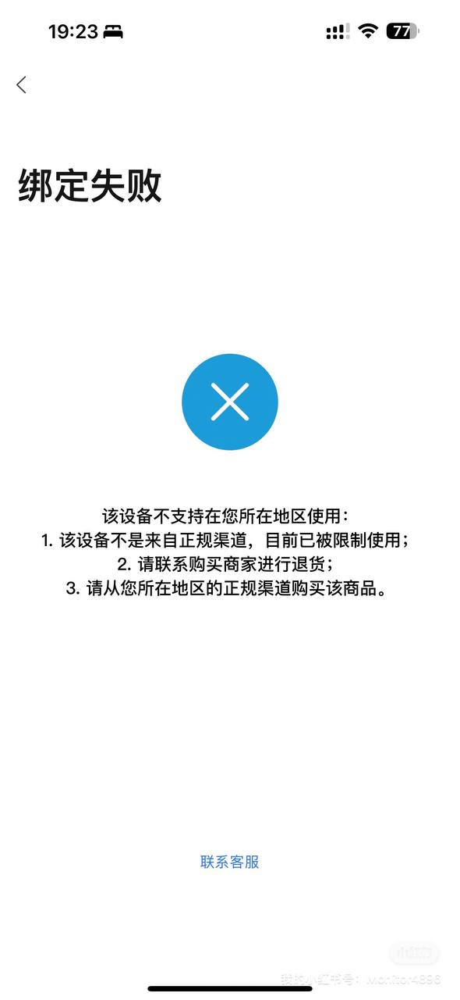
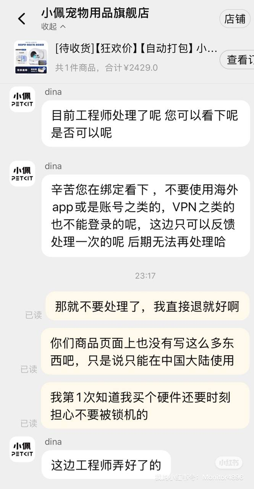
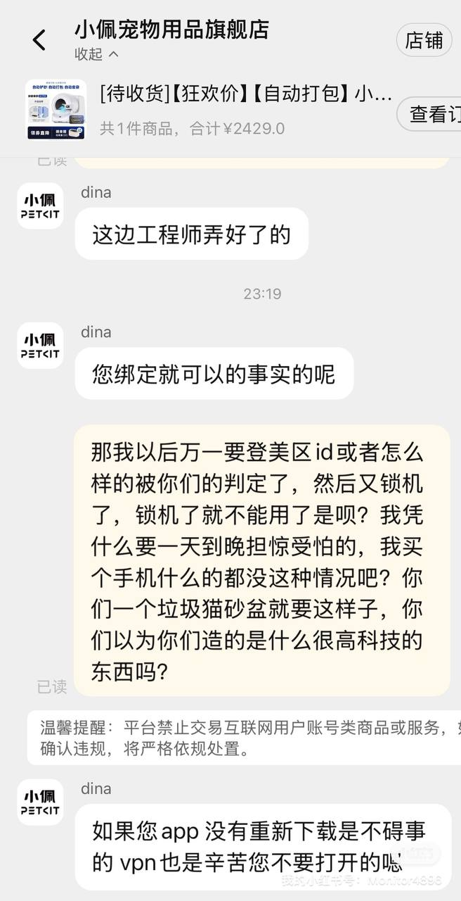

# 买了个小佩猫砂盆，没想到是“锁区设备”——国产硬件厂商又在重演老路？

最近在天猫买了个**小佩的自动猫砂盆**（¥2429 ），原本只是想图个省事，结果经历了非常“国产特色”的一幕：

**设备绑定失败，原因是“被判断为非中国大陆环境”。**

我人肯定是在大陆的，设备也是在大陆使用。

	

之后设备被永久锁定，无法被绑定。

找客服废话了数个小时后，分析出了“设备锁”规则，我整理如下，给大家避坑：

- 使用**非大陆地区的 Apple ID 或 Google 帐号**
- 手机系统语言非中文（比如英文界面）
- 使用或曾经使用过**VPN**
- 更换手机后重新下载 App （即使来自大陆商店）
- 系统误判当前 IP 为国外（哪怕你人在国内）
- 人出国后在国外打开 App （例如出差或旅行）

设备一旦被“锁”，客服明确表示“工程师只处理一次”，后续**无任何解锁手段**。

说人话就是：你买了个硬件，随时可能因为“后台环境识别误判”被远程彻底锁死，而且这事商品页面从来不说明。

	
	

## 一些个人思考：

国产厂商这几年在“软件定义硬件”的路上越走越远，从“云端强制注册”到“锁区”“阉割功能”，现在连宠物用品都敢搞“风控模型 + 远程封禁”。

这种做法本质上是**用户购买了实体设备，却没有设备的实际控制权**。

如果今天这是一台路由器、空调、电饭锅，是不是也可能因为登录了美区 Apple ID 就被停用？

设备厂商当然可以做区域市场划分，但这种“不透明”“不对称”“滥用远程控制”的做法，已经从“市场策略”变成了“用户背刺”。

这不是我第一次看到国产硬件厂商在搞锁区，但真的是第一次在这么低层次的消费品（一个猫砂盆）上看到这种处理方式。

也希望后续有关 App 的监管、智能硬件标准，能对“远程封禁实体硬件”这类操作设个红线。

目前我打算申请退款，同时也建议考虑入手这类“智能硬件”的朋友，提前搞清楚设备的所有限制条件，否则可能只是买了个外壳。
