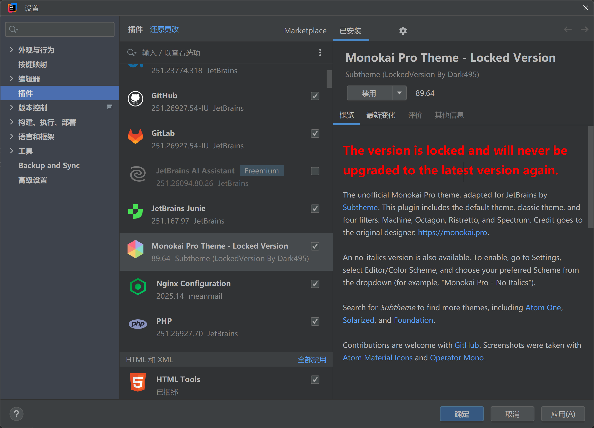

# 制作了一个永远不会升级的 JetBrains Monokai Pro Theme

## 为什么会有这个？

Monokai Pro 是一个非常好的配色主题，我从刚开始用 IDEA 的时候在数个主题中挑选了这个主题。

但是这个主题在最初版本发布时隔五年，在 2024 年 3 月莫名其妙的就开始付费了。

我并不是想白嫖或者什么，或许任何人都可以站在道德制高点来批判这些窃取他人劳动成果的人。

但我只是觉得时隔五年突然诈尸搞这么一出实在是令人作呕。

最近重装了 IDEA 后插件需要重新装，结果就自动装到了最新的 2.0.2 那个付费的版本，即使从官网下载 1.10 的版本仍然会强制升级。

于是我解压了这个插件的 1.10 版本，然后把版本号和插件 ID 乱改一通，以此实现了让此插件永不升级。

## 下载地址

[monokai-pro-jetbrains-locked-version-by_dark495.jar](./assets//2025-07-10_jb-monokai/file/monokai-pro-jetbrains-locked-version-by_dark495.jar)

~~https://www.dropbox.com/scl/fi/oixox7kwh65mlitshxer1/monokai-pro-jetbrains-locked-version-by_dark495.jar?rlkey=3rstlta2e67kpjh01r9egskvp&st=99zu50t9&dl=0~~
