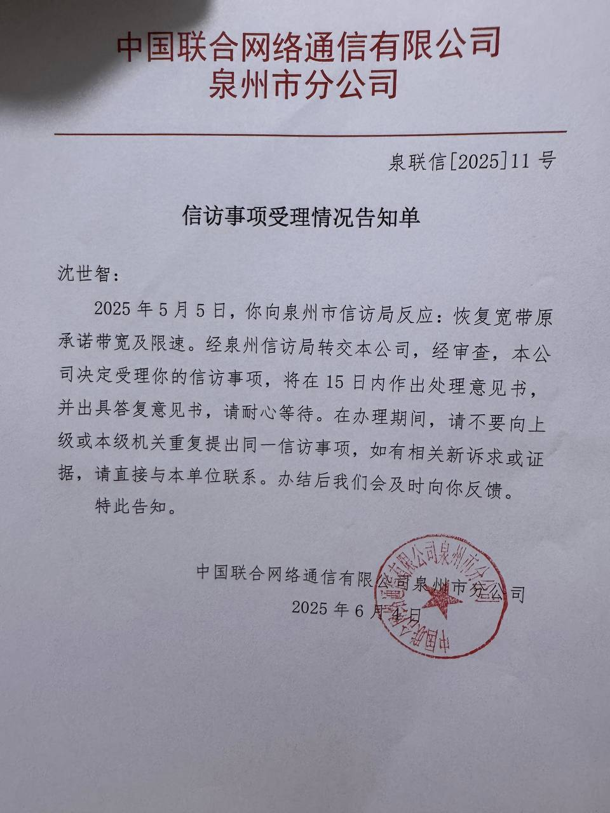
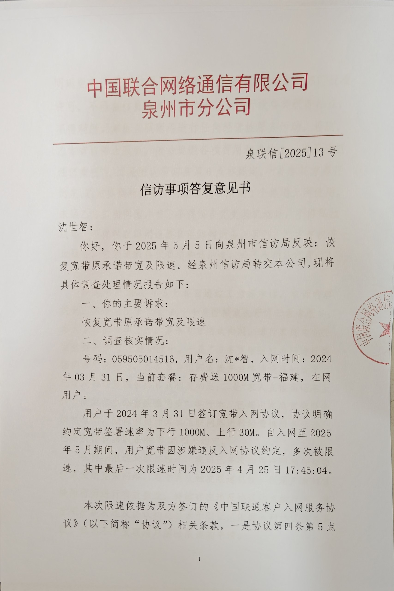
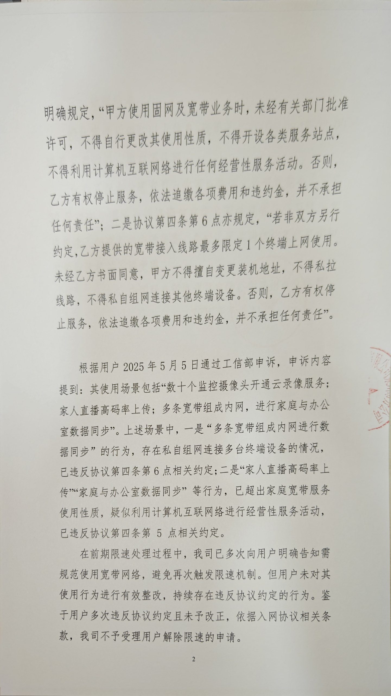
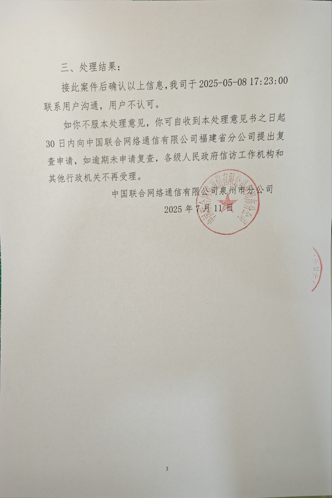
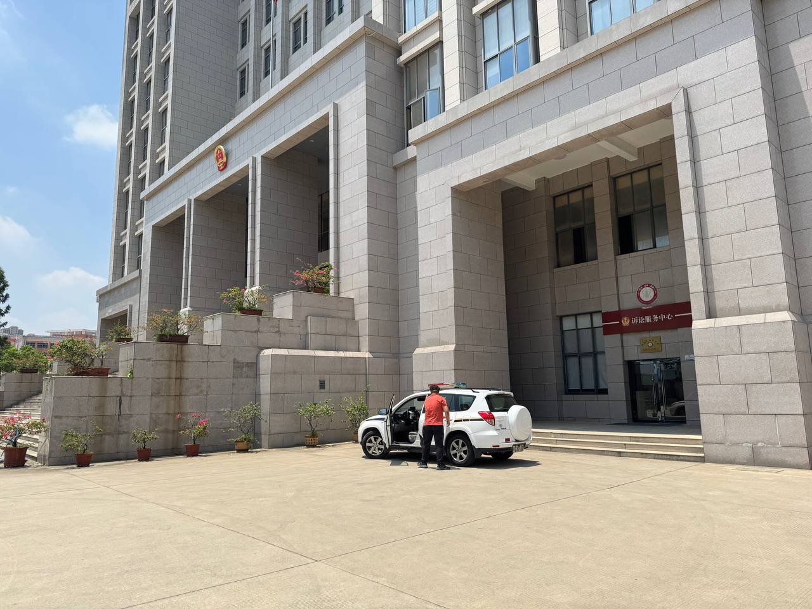
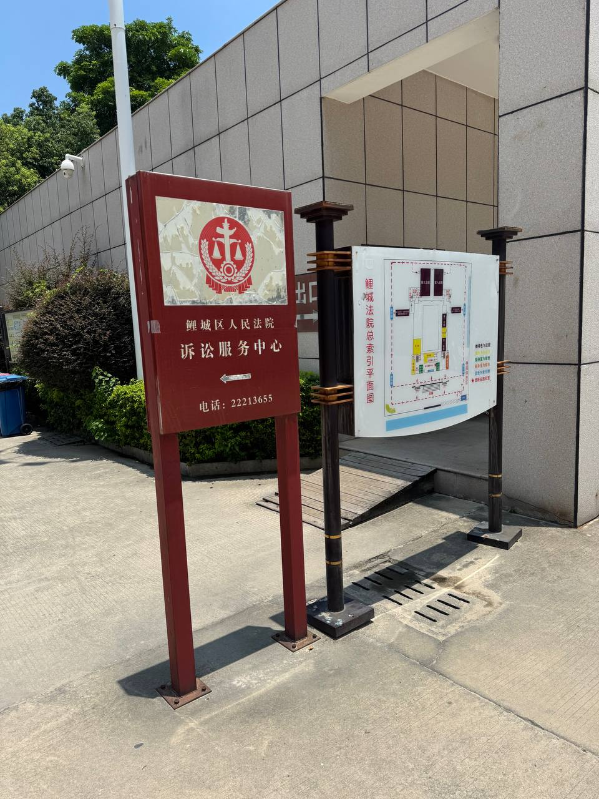
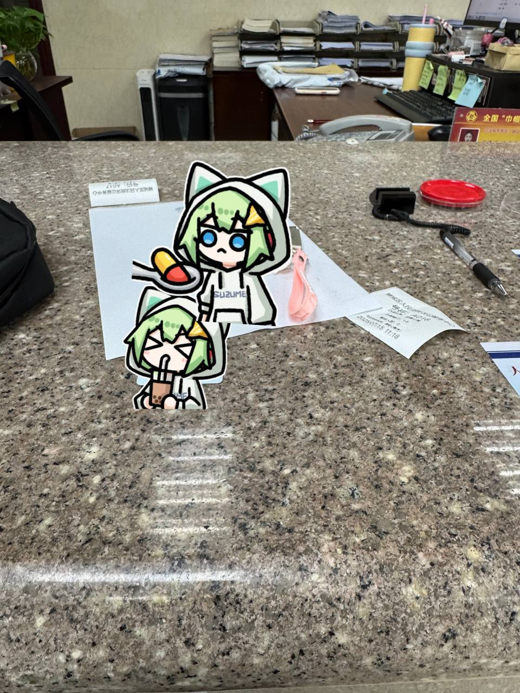
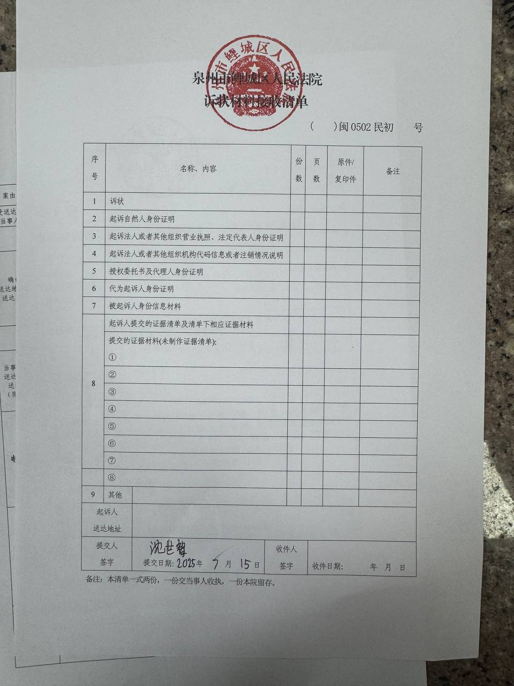
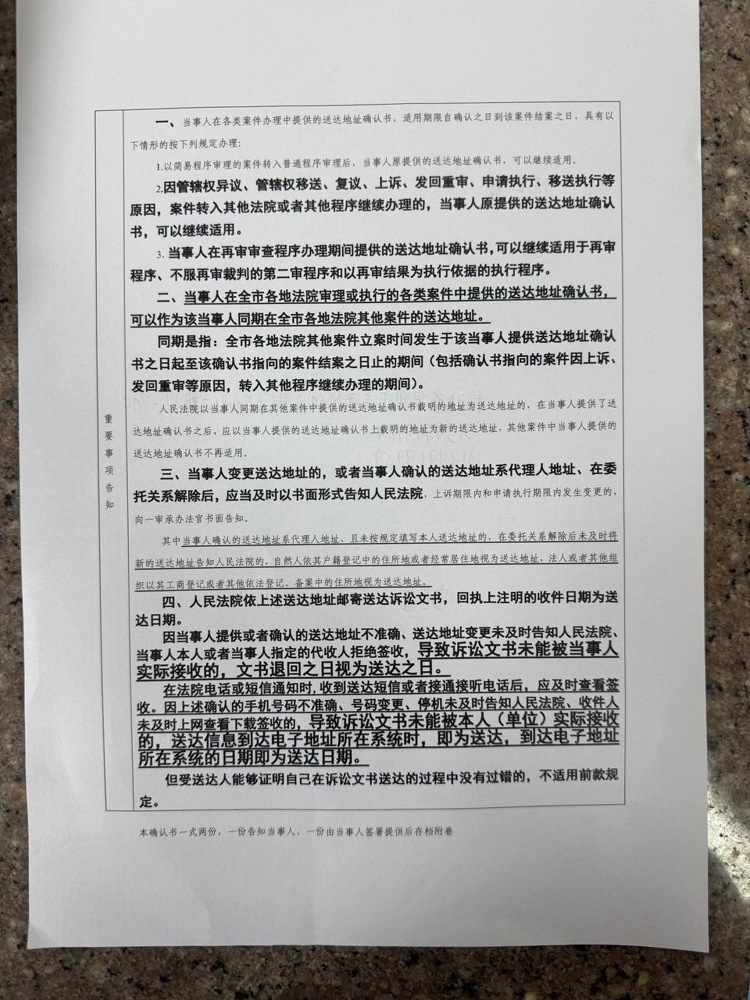

# 真的能笑死人。关于宽带被限速 信访以后泉州联通的答复

先说下，本人没有在跑 PCDN ，文件里工信部投诉的理由是真的。

在今年五月份提交信访以后，在 6 月 4 日没有任何通知的情况下莫名其妙的发了个顺丰快递，收到以后是这样的：

这下既当球员又当裁判了？信访局不转到工信部给我直接转到联通公司？

而且这日期，联通刚好在收到信访后拖了一个月（可能是最后时限？）才回复。

然后我坐等右等，还是没在 15 天后收到任何回复。

于是我查了下寄件人的电话，打过去，催他。

几天过后仍未收到，再打电话，已被拉黑。

---

今天早上 10 点终于看到又有个叫“联通公司”的发件人给我发快递了，可把我期待坏了。

然后刚刚，我收到了这个快递，打开以后是这样的：

## 差点没把我笑死，槽点多到无力吐槽。

本人实名上网，欢迎各网友、记者等人士任意转载。

这件事我会用我的业余时间杠到底。

## 补充：

我一条一条说吧：

1. 宽带是存费送的？的确，存费300可以送一条，但也得是建立在我已经开了办了个手机套餐且开通了一条宽带的情况下，也就是我的的确确是花了钱的，如果我不续费我的手机那这条宽带也会没有掉。

2. 一终端使用？您看看光猫，上面有几个口，至少四个对吧？这不是鼓励用户用多终端么？更别说现在很多宽带还送路由器，也没见路由器限制就一个连接数吧？

3. 高码率直播？没做过直播的人可能不知道，就随便播一个游戏，如果码率不高的话，会糊成一团，至少也需要20M的上行带宽才能勉强不糊。

4. 摄像头多？那这个的确多，用来全屋无死角实时记录生活以及回放，并且用来机器学习分析我自己的个人习惯之类的。

5. 多条宽带组成内网？并不是一个地址装了好几条宽带然后汇聚负载均衡那种，而是我办公室一条，家里一条，楼道里的摄像头因为没法拉网线所以单独一个光猫一条。这样能构成“私自组网连接多台终端设备情况”？意思就是我办了两条宽带，然后这两条宽带不能通过公网IP互相访问了呗？谁规定的？

6. 家庭与办公室数据同步？我同步的又不是商业信息，同步的都是一些我自己的照片、视频、异地数据备份（办公室也有NAS）等等，全是个人数据

7. 直播是商业用途？你随便开个直播app然后打开直播随便播一点没任何人看没任何人打赏的东西，就是商业行为了？我这里又不是十几个主播全窝在这里一起直播，如果真的是这种场景那的确可以说是商业。

泉州联通的刚刚看到通信人家园公众号发了这个帖子的内容，**刚刚打电话给我约我去 联通大厦 谈谈**，不过我都已经看到公众号下面一堆福建IP在洗，那我觉得没什么好谈的了。

我已经法院起诉，诉状和证据都非常丰富，所以接下来一切等法院怎么判。

