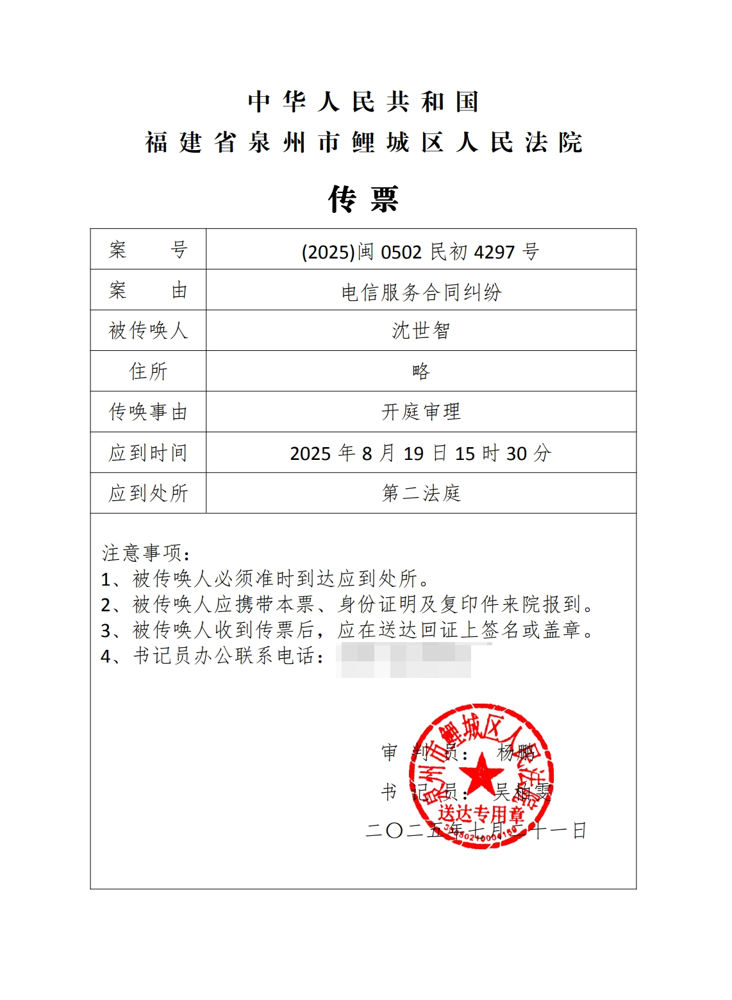

# 【后续】 在泉州联通回复信访以后，我起诉了。目前已经立案。

> 相关专题：[#泉州联通限速案](/#泉州联通限速案)

前文 [真的能笑死人。关于宽带被限速 信访以后泉州联通的答复](./2025-07-14_qzunicom_xf.md)

收到这三张纸的第二天我就去起诉了，诉状证据之类的一个月之前就写好了。

当时还不想折腾到这一步，那既然处理事情的态度这么差，如果我继续打碎牙往肚里咽肯定只会让自己难受，所以我还是跑了一趟法院去提交了。

---

就在刚刚，收到了法院的快递，我这趟跑法院没白跑。已立案。

---

诉状就先不公开了，判决完了再公开吧，可以蹲个后续。

---

题外话：这篇文章被发到了通信人家园的微信公众号，然后联通的舆情部门昨天看到了，于是立刻打电话**让我去联通大厦和他们谈**。我当时看了一眼公众号（因为我还不知道这个事情）看了以后呢，下面一堆福建 ip 在那里洗，把整件事往 pcdn 上引导。所以我就告诉他，既然你们都已经开始洗了，完全不想解决事情，**这就没什么好谈的了**。结果呢，他在没有通知我的情况下，直接跑到我家里来，当时我不在家，家里面只有一个小女生，他们**三个大汉就这么直接过来堵门**，还好是没有发生什么进一步的事情，他们很快就走了。

之后他们发现家里没人以后，又来打电话说什么“你现在有空吗？”“我们过来一下”“**来我家拜访一下（哈？）**”，我当时还不知道**他们已经上过门了**。我就说现在也没什么好谈的了，你们无非就是想让我删帖吗？删帖是不可能删的。现在就等法院判决，一切以法院判决为准。

## 补充

船票已到，欢迎来旁听（？

## 补充 2

狗联通在开庭前 6 天才提交证据，第三天邮政才送到我手里。

然后法院打电话告诉我，转简易程序了，开庭时间另定。

坐等新的船票。
