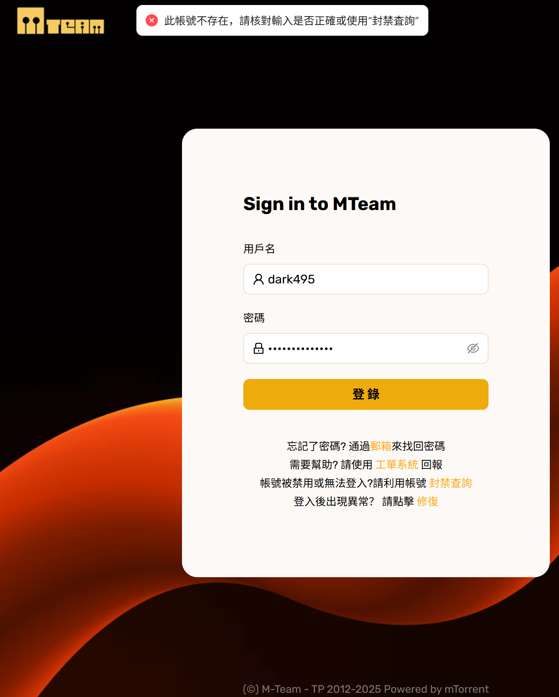
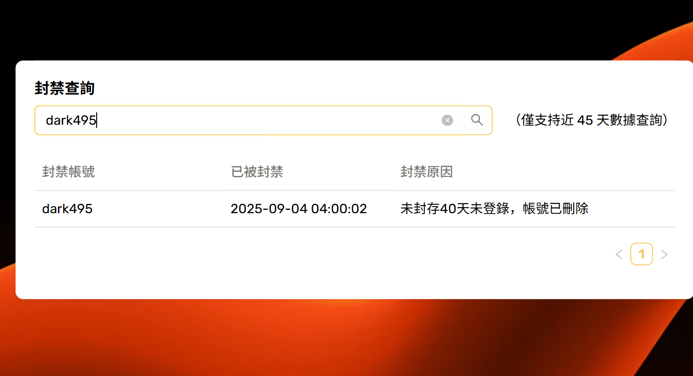
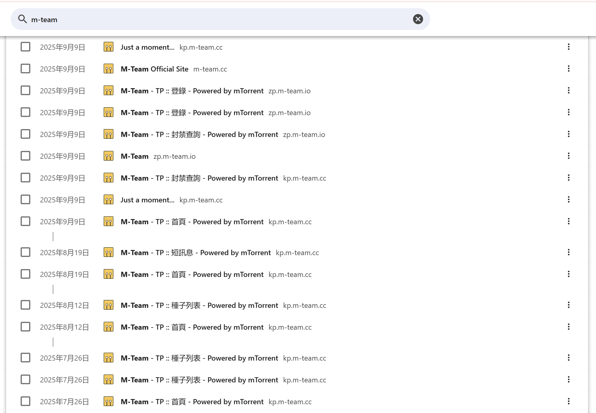

# 自上次给某 PT 站白干苦力以后，账号被删。

## 温馨提示

此贴不是要推广盗版，不是要闹事，只是梳理成一篇吃瓜文，以及告诫想要对某些项目进行用爱发电的“代码艺术者”

## 前文：

https://github.com/mteam-theme-sakura

## 最新剧情

- 图 1：登录页提示“此帐号不存在”
  
- 图 2：找回密码页也一样，提示“此帐号不存在”。
  
- 图 3：封禁查询结果，显示账号 dark495 在 2025-09-04 04:00:02 被处理，理由是“40 天未登录，账号已删除”。
  

## 吐槽两句

我平时有习惯——我把我所有的 PT 站点都放在了一个单独的书签组里，每个月至少会有两到三次的将此书签组所有链接全部打开，如果登录未失效且有二次 OTP 则输入 OTP 进入首页，如果登录已经失效则挨个重新登录。

以上操作均为手动进行，非自动化程序。

在此期间此站点的登录状态均为有效，访问后进入首页。

再说我这号注册大概一年，上传 16 TB 左右，用户等级不说特别高但也不低了。之前还给他们改过功能、写过主题。结局呢？ VIP 被收回不算，最后干脆直接把号删了。

## 玩下来最大的感受

你以为自己是在帮忙优化体验，他们心里想的只是“能白嫖点功能最好”。 你以为贡献了点东西会被记得，实际上你一停手就是“没价值的弃子”。 删号这件事特别说明问题：不是系统 bug ，也不是我真消失不见，而是单纯**懒得跟你说话，就找个最省事的理由踢掉**。

## 写给后来人

我写这个贴子只是想表明，作为一个程序员，如果你遇到了你觉得你会热爱的东西，不要一股脑子的就想参加贡献，首先应该认清楚：

- 对方是否只是想找你这种 无偿贡献者 来满足他们的 发大财 愿望，而非将您当作一个创作者。
- 对方是否会真的从内心尊重向您这样的用爱发电人士。
- 您对此所做的贡献，后期如果对方认为你无利用价值了，是否会被落井下石，甚至反向对你进行污蔑，导致用爱发电付出了精力以后还要付出更多的精力来回击对方的抹黑。

## 总结

我写这贴不是要闹事，就是留个记录：
这就是我在某 PT 站“贡献 → 被嫌弃 → 被删号”的全过程。

给大家提个醒：别太容易代入感动自己。因为到头来，**你以为在“共同建设”，别人只当你在免费搬砖**。

——完。

## 补充登录记录

