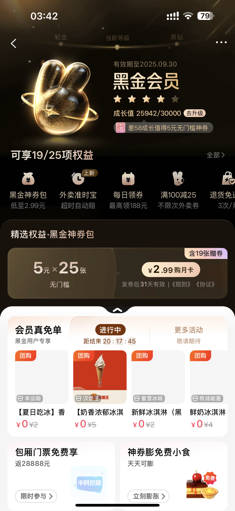
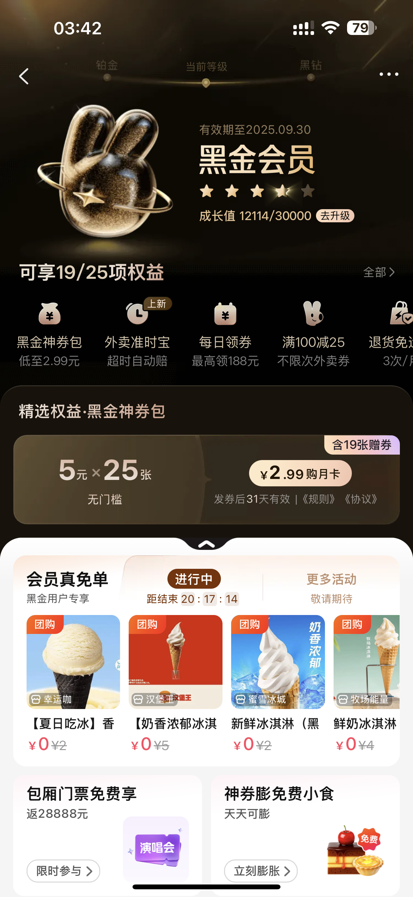
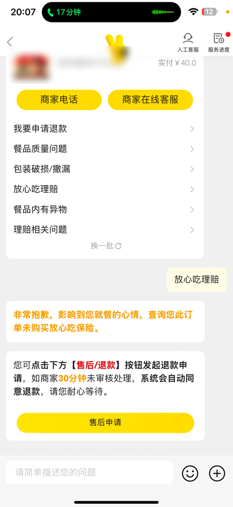
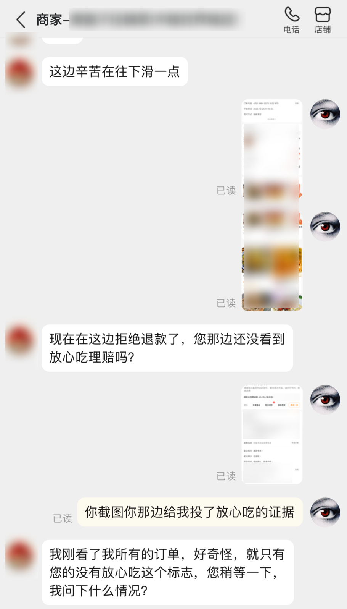
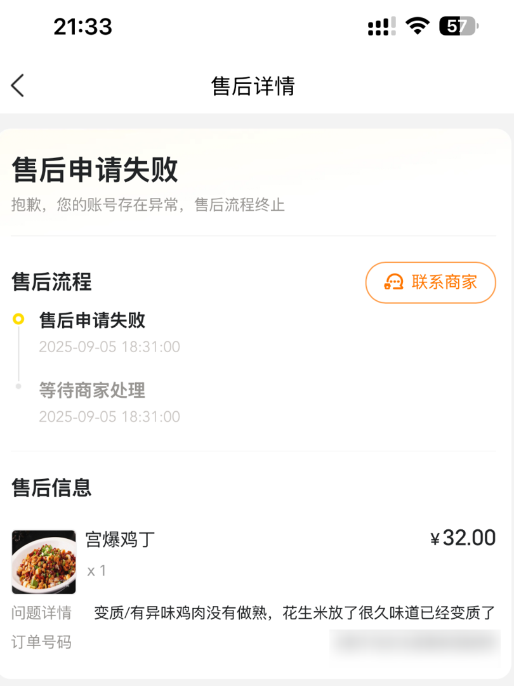
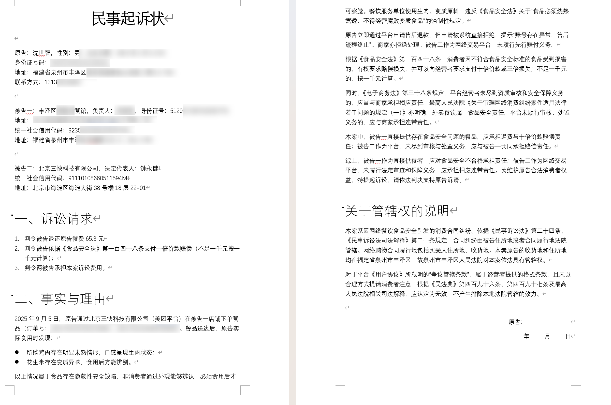
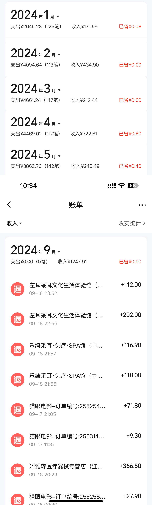

# 起诉实录：消费4万的美团黑金会员，被算法与客服逼到法院，现已立案

> TL;DR: 黑金老用户，多次售后要么秒拒要么客服掉线，‘放心吃’入口被关；最后一次点的餐品居然没熟，还拒绝退款。于是我直接在收货地法院起诉美团，并整理了完整流程和证据。

---

先说下`黑金会员`是什么：是美团的一个会员等级💎，`成长值`大部分是根据消费金额来增长，不做任务的情况下大约是单账号消费 **1w~3w** 即可达到（1元=1成长值）  
因为有多个手机号，最常用的两个美团账号分别是一个 **_1.2w_** 消费，一个 **_2.6w_** 消费💸，均为黑金会员，两个账号以及其他手机上的账号加起来轻轻松松达到黑钻等级了：

	
	

作为一个老用户，我最注重的就是**服务体验**。  
结果客服优先级算法好像有点大病🤔，客服调度优先级策略离谱：高消费用户反而更难接入。非要说高峰期，那是不是至少应该控制在一个合理等待范围，应该有一个等待上限吧。  
但美团却完完全全反过来，每次我需要找客服的时候，**要么排队超时**，要么就是复读机式模板化拒绝🤣。  
美团为了减少客服占用还提供了所谓`放心吃`，就是直接传图片就能立刻赔偿，但前提是你要**上传身份证😏？**。  
正常用过几次后，**我的“放心吃”入口在没有明确通知的情况下被关闭**（疑似风控），无法继续走快速理赔通道。  
说真的，只要不是太严重的我都懒得处理。

## 几个典型例子

“放心吃”被关后，有一次餐品撒的一塌糊涂，满袋子都是油，拿到手里满手都是油，放在地上也是油🙄。  
`商家端`显示本订单未投“放心吃”，**而其他订单普遍有😒**。

	
	
	

因为我避免浪费😴等我穿衣服开门的时间，我都是直接写**放门口按门铃就行🔔**，结果这个骑手**未告知的情况下直接放门口就跑**。  
电话联系骑手要求拒收或补偿无果，只好找客服，客服在看到我上传的**清晰的洒漏照片**后，处理结果就是一键三连：**看不出问题、不退款、不赔偿**，请您认栽呢。  
之后又浪费了很多时间（**在线客服**_几乎接入不进去_，电话客服要**等半个小时以上**），最终普通客服没权限，都是转高级客服，然后高级客服答复**仍然是**看不出来问题、不退款、不赔偿，**请您认栽🤗**。

我当时已经有了起诉的心态了，但是碍于没有特别多的学习法律相关知识，以及对于此事我要投入过多时间和精力，遂放弃。  
后来又有数次的售后经历，**在没有放心吃以后我不得不浪费时间去找商家和骑手**，幸运的是大部分情况下都解决了，但我仍然浪费了大量的时间😠。

## 结果最后一次不得不找美团客服的售后的经历，让我彻底死心，决定杠到底，并彻底弃用美团。

我最后一次在美团点餐，点的是宫保鸡丁  
~~（刚刚从重庆出差回来，公司楼底下的某菜馆的宫保鸡丁让我印象深刻😍，让我这个厌食症都能吃得下口了，于是想在本地能不能幸运的找到类似口味的）~~  
结果到手以后，订单小票上的取餐编号是 `#2` `#3`，也就是这家店**到了下午17点快饭点的时候**的居然才有**3个订单**？心都凉了半截💔。

那行吧，既来之则安之，那就尝尝吧。  
先挑了几个花生米🥜，**第一口就是放了很久的味道**（感觉像是放了个一年半年的，很陈的味道），很难说，总之第一口下去就知道不对劲了。  
然后是宫保鸡丁的鸡丁本体🐔，吃了几个味道真心难吃，后面我终于知道为什么难吃了，**因为根本就没有做熟🤮🤮🤮！！！鸡丁断面发白发黏、肌理生硬，明显没熟**  
当我吐出来，看到白花花的鸡肉，我的好心情瞬间没了。真的，你脑补一下，这一小块 **_生的_** **_滑溜溜_** 的鸡肉的东西在我的嘴唇游荡了一下以后，恶心坏了。  
真的很难以言表当时的心情🤮🤮🤮🤮。

	

---

接着又是艰难地找美团客服，美团将我的联系客服的渠道完全封死：

- 🤖在线客服永远是 **要你排队，然后排队10分钟后自动断开，以此往复**
- 📞电话客服接通后永远是机器人，只会告诉你 **话务繁忙让你找在线客服**，即便你反复和机器人说“转人工”也 **完全不会给你转人工**。

我直接申请了退款，结果秒拒绝⛔，页面显示 **“售后申请失败，抱歉，您的账号存在异常，售后流程终止”**

	

无奈，多年使用经验的我知道一种联系客服的办法：**找一个最近没在美团消费过的电话号码😇，打`10109777`，然后直接告诉他你的下单手机号，让他`回拨此手机号`。**  
嗯，这么做的确成功了，但结果仍然是：在我上传了**清晰的未熟鸡肉照片和视频**后，客服仍然是**没看出问题，不退款、不赔偿、请您认栽🤗**。  
随后我联系了商家，商家是一个中年人，语气非常强烈🤬，让我直接在平台上申请退款。  
我告知我无法申请后，他说他也没法处理(实际上商家有入口可以处理)，随即被立刻挂断电话📵。

接着我又用另一个号码打美团客服，这次又变成了永无止境的机器人（🤖仿真人的声音还真像），于是我**改用未在美团消费过的号码拨 10109777，请其回拨至下单手机号。**。  
接通，让他回拨，告知问题，让之前处理此订单的客服专员联系我。  
然后呢，此客服专员在听完录音后，表示无法听出商家愿意退款的意愿😏（商家仅口头让‘去申请’，但未在系统点击同意→平台判定‘商家不同意’，因此不退），还是让我自己去找商家，在商家同意之前无法退款。

## 我彻底死心了，决定起诉美团。

鉴于上次起诉泉州联通的经历，我已经有了一些经验。

写好诉状🧑‍⚖️，内容主要包括

- 诉求：退款、十倍赔偿、
- 时间、日期、订单信息
- 简单的事实经过：收到的餐变质，商家和平台均不处理
- 投诉经过：客服无法接入，后续态度恶劣，完全不像是对待消费者和一个老用户的态度
- 相关法律条文
- 管辖权的说明：我起诉了两个被告，一个是商家，一个是美团，美团在北京，我大概说明了一下：
    - 《民诉法》第二十四条、《民事诉讼法司法解释》第二十条，合同纠纷由被告住所地或者 **合同履行地** 法院管辖。网络购物合同履行地包括买受人 **住所地、收货地**。
    - 对于平台《用户协议》所载明的“争议管辖条款”，属于经营者提供的格式条款，且未以合理方式提请消费者注意，根据《民法典》第四百九十六条、第四百九十七条及最高人民法院相关司法解释，应认定为无效，不产生排除本地法院管辖的效力。
    - 总之就是：直接在收货地法院起诉

	

以及整理好证据清单🗒️，大概如下：

- 订单信息（订单号、金额、收货地址）
- 申请售后被拒绝
- 和平台客服电话录音（需要刻录光盘）
- ~~和商家电话录音~~ （这个没录到，苹果没有自动录音并且录音还要等三秒，~~Only Apple Can Do~~）
- 营业执照、食品经营许可证：在商家店铺的食品安全档案可以看到
- 申请售后被拒绝的录屏：`点击申请售后->食品安全问题->提交` 系统秒拒绝，显示“售后申请失败，抱歉，您的账号存在异常，售后流程终止”
- 餐品未熟的照片

| 序号 | 证据名称                       | 证据来源                 | 证明内容                                                                                 | 页码              |
| ---- | ------------------------------ | ------------------------ | ---------------------------------------------------------------------------------------- | ----------------- |
| 1    | 订单xxxxxxxxxxxxxx8965信息     | 原告在“美团App”内截图    | 原告在被告一店铺、被告二平台下单购买了“宫保鸡丁”菜品，实付27.4元的事实。                 | 2-3               |
| 2    | 订单xxxxxxxxxxxxxx8698信息     | 原告在“美团App”内截图    | 原告在被告一店铺、被告二平台下单购买了“宫保鸡丁”菜品，实付37.9元的事实。                 | 4-5               |
| 3    | 订单xxxxxxxxxxxxxx8965售后申请 | 原告在“美团App”内截图    | 原告在被告二平台申请售后提示“售后申请失败，抱歉，您的账号存在异常，售后流程终止”的事实。 | 6                 |
| 4    | 订单xxxxxxxxxxxxxx8698售后申请 | 原告在“美团App”内截图    | 原告在被告二平台申请售后提示“售后申请失败，抱歉，您的账号存在异常，售后流程终止”的事实。 | 7                 |
| 5    | 照片                           | 原告收到实物拍照         | 被告所售餐品鸡肉存在肉眼可见未熟情况。                                                   | 8-10 (附光盘附件) |
| 6    | 屏幕录像                       | 原告在“美团App”内录屏    | 被告二平台直接拒绝了售后申请的事实，其他同证据3、4证明目的一致。                         | 见光盘附件        |
| 7    | 营业执照、食品经营许可证       | 原告在“美团App”内截图    | 被告一在被告二平台开设外卖店铺的事实。                                                   | 11-14             |
| 8    | 通话录音                       | 原告与被告二客服通话录音 | 被告二平台拒绝处理退款申请的事实。                                                       | 见光盘附件        |

以上证据很快就整理好了，谁让我

- 📃 刚好有打印机之前提前在PDD买了一堆便宜的A4纸
- 📀 刚好有光驱并且因为之前泉州联通的官司得知法院只收光盘后买了一堆空白光盘备用
- 🖼 刚好之前因为寄送礼品买了一堆铜版高光纸

当然，本人不是法律专业，也是借助AI狠狠的恶补了一下法律知识（当然法律条文是一定要参照原文核对的，不然很容易错😖）  
才写出上面的诉状和证据清单的，可能冗长啰嗦，或者有不妥之处，🥺欢迎各位大佬指正。

---

在这次再次遇到美团客服这么恶劣的态度后🤬，我立刻着手开始整理证据以及写诉状，⏱️用了**大概两三个小时**。  
我将诉状和证据清单打印出来🖨️，然后刻好了证据光盘，特别是那张没熟的鸡肉图片我还是用**高光铜版纸打印的，色彩艳丽高清无码**，就是为了让被告和法官能清晰的看到这tm有多恶心。  
然后第二天一早，我就去了我所在区的人民法院立案。

结果没想到的是，管辖地没什么问题，的确可以在我这里的法院起诉。  
但对方是个体工商户，而个体工商户则需要他的个人信息🪪，也就是`身份证号、电话号码、户籍地址`，而除了电话，其他我并没有。  
如果被告是个体工商户而不是企业，只有营业执照的统一信用代码不够😇我也是第一次知道。

虽然遇到了一点困难，但还是成功立案了，身份证号是怎么搞到的呢？那当然是正规手段了😋。  
如果你缺这个，法院可以开类似证据缺失的函，然后你就凭此可以去 `派出所` 或 `政务服务中心` 或 `市场监督管理局` 等等地方调取，一个地方不行就另一个地方试试，体现你社会工程学的地方到了。  
一上午的时间都是跑各种地方了，立案反而没用多久。

# 总之，我已经成功立案，接下来就等开庭了。

当天就给了我`立案通知书`，后续进展我会补充更新，欢迎**点击收藏** ( Github 是 `Watch` ) 推送后续更新。

	

# 关于如果有人需要我的"良民证"

作为一个懒得自己做饭的全职程序员，外卖是我日常生活中不可或缺的一部分，除了应酬几乎就是外卖了。  
我始终认为自己做饭和点外卖相比，做饭所付出的`时间和精力成本`远远高于点外卖。  
但最近遇到的这些事情，让我已经试图减少甚至放弃点外卖了，准备学习自己做饭🥘。

⚠ 有人会怀疑我是不是经常恶意退款，毕竟我消费了4万多（如果算上其他我因为换手机号而不用的账号，可能更多，无法统计了），按理说不至于吧。  
我可以很负责任的说，我从来没有恶意退款过🫠。  
**我所有的退款都是因为商家包装过于简陋导致骑手餐撒😮‍💨，或者就是骑手摔餐后（我相信是不小心，但是的确严重影响食用的情况下）死不认账😥**  
**我从来没有因为口味不合适，或者觉得不好吃而退款，甚至都没有申请过因为治病就医而退款🤢，闹肚子什么的我都有心理准备，自己吃点药自己认了**

我觉得我作为一个消费者，

- **我有权利🏪要求商家和平台提供符合食品质量的餐品，而不是让我去认栽。**
- **我有权利😮‍💨在遇到问题时要求商家和平台提供合理的售后服务，而不是让我去认栽。**
- **我有权利🎧在遇到问题时联系到平台的客服，而不是让我去认栽。**

我不知道美团是嫌用户太多了倒闭的太慢，还是觉得老用户就应该被随意欺负反正也不会流失？  
如果美团倒闭，我第一个鼓掌庆祝🎉。

# 关于订单数量和退款次数

收入并不全是外卖退款，我看了下基本由几方面组成：

- 电影票退票
- 购买了优惠券以后不打算用了退款/长期未使用自动退款
- 线下商家要求更换套餐于是退了重新拍
- 便利店单件缺货退款
- 便利店缺货整单取消
- 外卖售后只占了非常小一部分，一个月应该也就三单左右。

以及，订单在没有出差的情况下基本都在150左右，出差的话少一点

更多的的以及近期的我真的懒得翻了，如果美团有一键查看全部订单数量和退款记录的功能我可以上传。

# 关于转载

此文原始发布于Github：[https://github.com/xlch88/pihua/blob/master/2025-09/2025-09-16_FuckMeituan.MD](https://github.com/xlch88/pihua/blob/master/2025-09/2025-09-16_FuckMeituan.MD)

允许任何、任意形式的转载（包括但不限于个人、媒体、机构转载），但请尽可能地保留原始链接和作者信息。

同时本人接受媒体采访，联系方式：

- i@dark495.me / flandrestudio.cn@gmail.com
- Wechat: BPM8964
- QQ: 787700998

本人实名上网，所言均为个人真实经历与感受，绝无虚构。🤕
