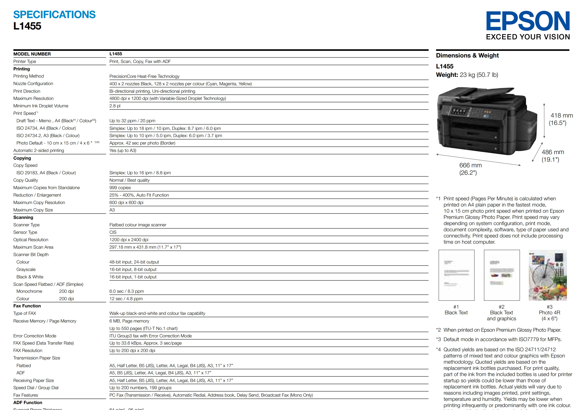
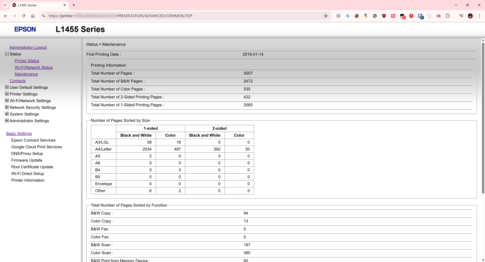
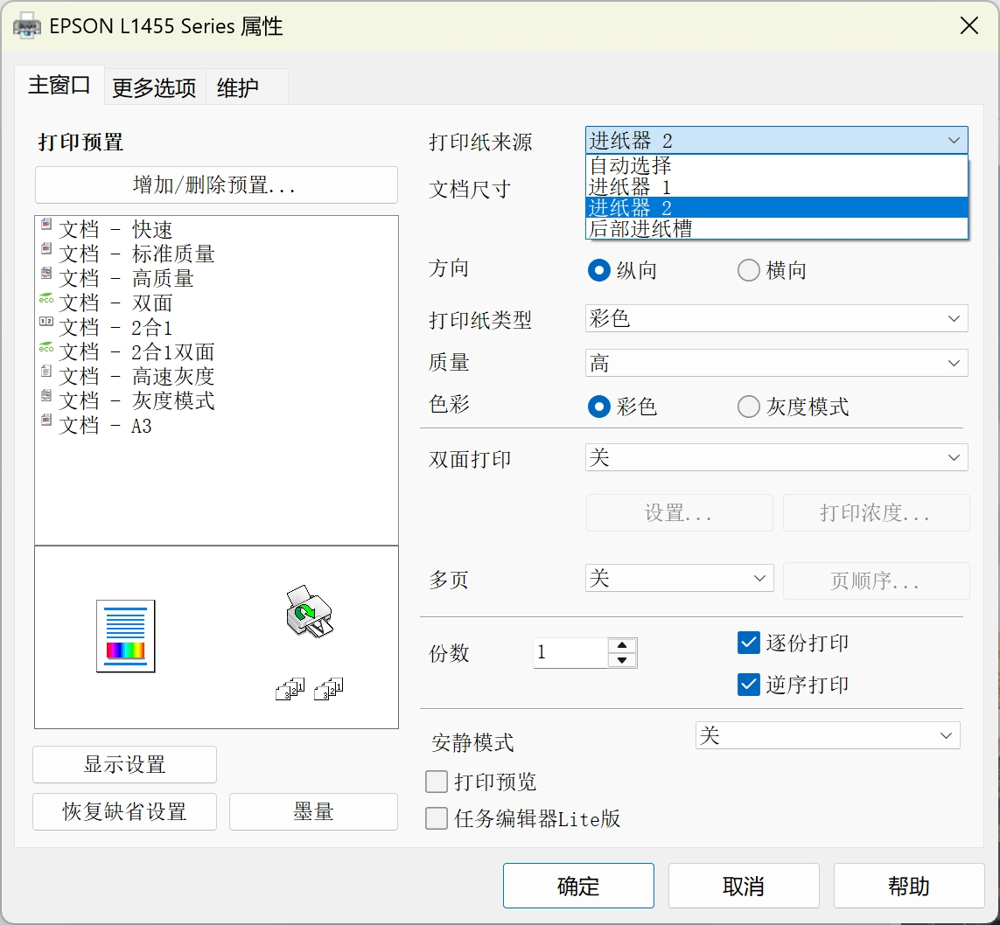

# 这可能是我最近几年买的最好玩的电子垃圾了，爱普生L1455全功能打印机

	

## 先说说这个打印机有什么功能：

- 支持最大 **A3纸，最高300g/㎡** 硬光面纸打印
- 支持全自动**双面**打印、扫描、复印
- 有线网络/WiFi/USB连接 ~~（但WiFi祖传的72Mbps）~~
- 支持 **_全自动、双面的输稿器_** ，只需要把你要扫描的东西放在顶部，按下扫描就行了
- 支持自动上传 **Samba/FTP**，扫描的东西可以直接传到NAS或电脑上
- 双纸盒设计，可以同时放两种不同尺寸的纸
- **无需手动切换纸盒**，只需要打印的时候选择用哪个即可
- 4.3寸彩色 **_触摸屏_**，操作方便
- WebUI 控制
- 支持外置存储，包括 SD 卡、U 盘
- 自带墨仓设计，_不用换墨盒或自己改连供_

...等等等，功能非常强大，基本上是能有的功能都有了，没有的也有了。  
可能对于我来说这样一个东西很有意思吧，用的多的人可能见怪不怪了。

	

[datasheet(规格书) PDF 来自官网](./assets/2025-09-18_printer-L1455/pdf/Epson%20L1455%20BROCHURE.pdf)

## 唯一的几个缺点吧：

- **体积大**，毕竟是A3的，而且集成了一堆功能，卖家发货的时候是直接打了个木架发物流的
- 只有 **四色** 而非 **_六色_**，仍然存在 **_RGB转CMYK色差问题_**

## 那我为什么脑子一抽买了呢？

主要是有大批量的文件需要扫描备份。  
然后看了下网上专门的**输稿器**或扫描仪，发现性价比都很差劲，并且要么不支持双面，要么就不支持自动输稿。  
于是就闲的没事干去Google了一下各种古早打印机的datasheet，然后再去咸鱼看了看价格，最终选择了这个。

这个玩意我收的二手的只要 `1200元`，性价比可以说超值了。  
并且使用率看起来不高，虽然是 `2019年` 的机器，外面的塑料也有点发油光，但没有什么划痕。  
打印页数*只有区区3000多页*，远低于它的寿命。

	

而且卖家发货前把墨水灌满了，基本上可以用好久了。虽然我也自己买了墨水备用。  
~~（貌似还把废墨盒破解了？读取不到废墨盒的数据）~~

## 使用感受

对于我来说，最让我感到舒服的就是能全自动双面扫描+**自动传Samba**了。

	

以及有一个 `用户友好的触摸屏界面` 和 `一堆按键`，大部分功能 _不需要去电脑_ 上操作了，更别说装麻烦的驱动。

唯一的一点点小遗憾就是不是六色的，打印照片还是会**暗淡**一点，不如我之前六色的L8058效果好。  
~~并且不支持打印光盘~~，虽然这么密集的设计的确是没地方再放光盘托盘了。  
当然这也是我要求太多，用过一些好的就想要更好的 :(  
_（对，光盘是可以打印封面的，的确可以，不过现在使用光盘的人很少了，更别说还有心思设计光盘封面了）_

## 一切都好

买之前真的挺担心暗病以及成色，特别是墨盒以及一些硬件老化的问题，  
硬件老化很容易导致卡纸，这个很头疼，并且很难修。

以前在某个做政府项目的公司实习的时候，看到公司的老师傅能完整的把一台打印机所有零件全部拆开，然后原样装回去。  
能记住并且熟练掌握如此复杂的东西，真的很羡慕他的手艺。

不过还好，我担心的多余了，这台机器目前为止运行的都很顺利，真的是给我带来了一点点生活的快乐。

## 打印效果

（A3光面纸，最高质量打印，但颜色鲜艳度真的不如L8058）：

	

（A3 100g普通纸，高质量）

	

打印A3唯一的缺点是有大约0.5cm的白边，应该是驱动限制，无法打印无边距。  
对于硬纸，只能通过后部进纸槽直接插入，并且每次只能插入一张纸，不能放在纸盒里。

	

