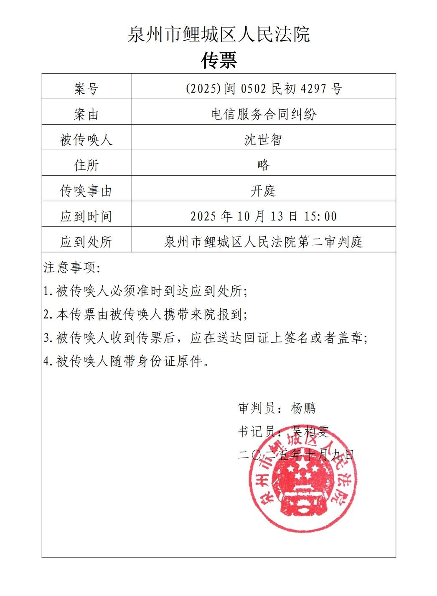
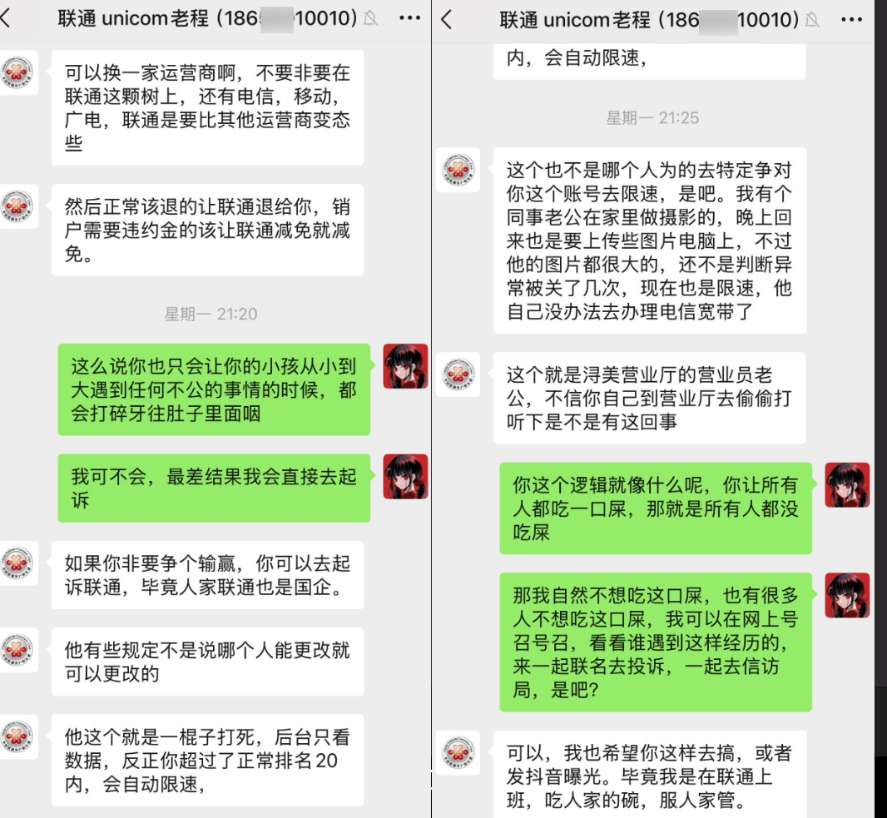
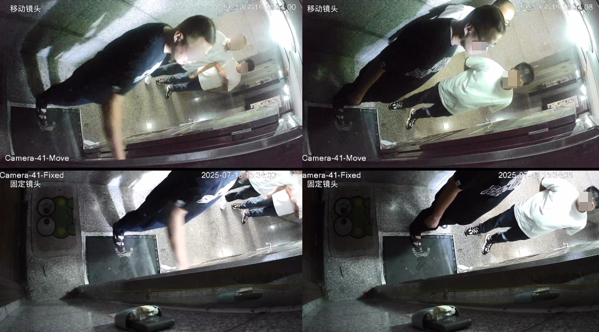
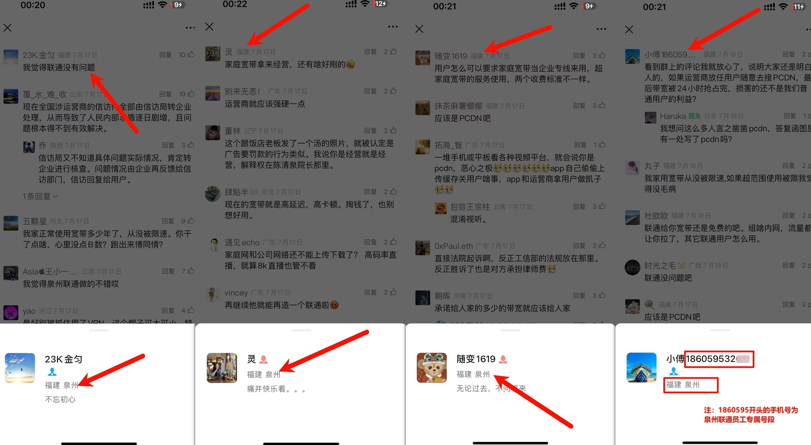

# 【后续 2】 泉州联通案件的近期情况，以及 10月13日（15:00）开庭｜地点：泉州鲤城法院

> 相关专题：[#泉州联通限速案](/#泉州联通限速案)

> TL;DR：对方多次限速且拒绝举证→我起诉。原本一个月的小额诉讼，被对方“开庭前6天突击堆证”拖成简易程序（最长3个月）。现已确定：10月13日15:00，泉州市鲤城区人民法院，欢迎旁听。

前文：

- 2025-07-19 [【后续】 在泉州联通回复信访以后，我起诉了。目前已经立案。](/2025-07/2025-07-19_qzunicom_qs.md)
- 2025-07-14 [真的能笑死人。关于宽带被限速 信访以后泉州联通的答复](/2025-07/2025-07-14_qzunicom_xf.md)

---

首先，收到了最新的传票，开庭时间是10月13日15点整，地点是泉州市鲤城区人民法院。

🤗 欢迎有条件的朋友前来旁听。

	

# 🥹 为什么会这么慢？

如果一开始就关注的朋友应该知道立案时间是 `7月17日` ，第一次确定的开庭时间是 `8月19日`。  
然而这次开庭时间是 `10月13日` ，从立案（2025-07-17）到现庭期（2025-10-13），约88天，`接近3个月` 。

#### 那这三个月到底被拖去哪了？🤔

本来一开始其实是小额诉讼程序， **一个月就审结** 。  
但泉州联通干出了一件很恶心的事情，从立案后的15日的举证时间里，什么动静都没有。  
然后突然在开庭的 `前6天` 才临时提交一堆所谓“证据”，过了三天以后他提交的证据才被EMS邮寄到我的手里。  
然后就在 **开庭的前一天** ，法院打电话告诉我，因为被告提交了 _非常大量的证据_ ，考虑到案件的复杂程度转简易程序了，开庭时间另定 :)  
而简易程序的审理时间是 `3个月` 。

#### 那么他到底提交了什么证据呢？🤮

**他提交了几十页的 _“入网协议”_ 以及一些几乎无关的比如说什么反诈须知。** 嗯，没什么好说的，的确 _挺大量_ 的。  
当然晚提交证据会有处罚，简单来说按程度排名就是：`训诫` or `罚款` or `不采纳` 。  
但我估计对于被告这位国企来说大概率也就是口头训诫，没什么大事😏。

就这样，本该 1 个月完事的案子，被他们硬生生拖成了 3 个月。
不过好在这次应该不会再出现上次那样的情况了，今天是10号，3天后就开庭了，这三天应该出不了什么幺蛾子了。

# 🫤 首先挂一些泉州联通的（黑料）

虽然我真的不想难为一线的装维师傅，他是最辛苦和最无辜的人。😇  
但，他说出的事实就是证据，而且很能说明问题。

	

> “联通是要比其他运营商变态些”

> “如果你非要争个输赢，你可以去起诉联通，毕竟人家联通也是 **_国企_**。”

> 他这个就是 **一棍子打死**，后台只看数据，反正你超过了正常排名20内，会自动限速。

> 这个也不是哪个人为的去 **特定争对你这个账号去限速** ，是吧。

> 我有个**同事老公在家里做摄影的，晚上回来也是要上传些图片电脑上，不过他的图片都很大的，还不是判断异常被关了几次**，现在也是限速， **_他自己没办法去办理电信宽带了_**

> 这个就是浔美营业厅的营业员老公， _不信你自己到营业厅去 **偷偷打听下是不是有这回事**_

### 🎙️ 一些通话录音节选

简单总结：我说你不合规但我没证据提供给你、不退费、不解限速、自己滚去拆机。

> 📞 联通：宽带的话有监测到使用不合规的一个情况。目前我们没有办法做此方面的这个网络速路速率的一个解除。  
> 👤 我：那好，我现在让你们提供 **相关的证明，证明说 _我这个宽带有什么就是说什么不合规使用之类的_，你们能提供证明** 吗？  
>  \*\*忽略废话\*\*  
> 📞 联通：您反馈的这个情况，包括您有通过工信部跟工商反馈，我们这边也会跟监管部门对应进行一个对接提供的。这个我们没有办法对您这边进一步做提供。  
> 👤 我：就是你们没有相关的证据能够提供到给我是吗？  
> 📞 联通：凭证方面，我们会跟相关监管部门进行，\*\*打断\*\*  
> 👤 我：**就是不能提供给我本人是吗？**  
> 📞 联通：**是的** ，刚刚已经有回答过您了。  
> 👤 我：好，也就是你们没有办法给给这个用户，就是说证明有什么说你们这个违规的这种情况，对吧？  
> 📞 联通：这个我们确实没有办法进一步给您做进一步的提供。  
> 👤 我：然后现在这个结果就是说这个宽带就是不能解除限速。然后我要求这个退费的行为也是不行的。  
> 📞 联通：您要求提供1月份到5月份的手机套餐费用，这个我们没有办法进一步做提供的。  
> 👤 我：我应该 _一共给你们说过差不多五六次这个情况，这个这个已经解了 **五六次** 了_ 。那请问一下，如果我第一次你们说是有什么违规，OK那第二次、第三次、第四次，那 **后面为什么还继续解呢** ？  
> \*\*忽略废话\*\*  
> 👤 我：不是我问你的是什么？你如果是觉得真的违规的，那后面为什么第五次啊，这一共应该是有5次，为什么这么多次的都可以解呢？  
> 👤 我：然后唯独到现在了，又跟我说不行了。**这个逻辑性何在呢？**  
> 📞 联通：刚刚有已经有回答过您了，前期我们这边也是考虑您使用需求有特殊做处理，并且有提醒过您后续没有办法再次特殊做处理。  
> 👤 我：你说到那是第一次，我问的是后面。  
> 📞 联通：先生，前期的这个处理情况，我们人员方面有特殊做上报给您做处理的。但是我们目前确实没有办法再进一步解除了。_(明显是绕开我提出的问题)_  
> 👤 我：OK现在的情况就是你们既不能提供给消费者，你们这个所谓的什么违规的凭证，然后这边也不能解也不能退费。  
> 📞 联通：宽带可以到营业厅去销户，看您什么时间要去哪一家营业厅办理。如果您要求我们给您退还手机的这个套餐费用，这个我们没有办法给您进行退费的。

### 😖 舆情介入后的“上门施压”经过

	
	 
	开门前：看到我有 [可视门铃] 于是其中两个人躲到死角 
	开门后：三人一起围上来堵门 
	但他们三都靠近以后才发现 [原来头上还有个摄像头] 耶🫠

**🤬 堵人事件回顾：**

最早的信访回复那篇文章被发公众号，然后被舆情部门看到，我电话明确拒绝和他们谈，结果直接上我家门口堵门，但我人不在家，他们也就没做什么进一步的事情，

请问这三位不带脑子的联通大汉，你们觉得在 **对方明确发现你们在 _抹黑对方/洗白自己_ 、明确在电话里表示这样的态度没什么好谈的情况下**，仍然 **带着三个大汉堵门试图强行和我面谈**，是不是很有素质？

> 来源：[【后续】 在泉州联通回复信访以后，我起诉了。目前已经立案。](/2025-07/2025-07-19_qzunicom_qs.md)
>
> 这篇文章被发到了通信人家园的微信公众号，然后联通的舆情部门昨天看到了，于是立刻打电话 **让我去联通大厦和他们谈** 。  
> 我当时看了一眼公众号（因为我还不知道这个事情）看了以后呢，下面一堆福建 ip 在那里洗，把整件事往 pcdn 上引导。所以我就告诉他，既然你们都已经开始洗了，完全不想解决事情，这就没什么好谈的了。  
> 结果呢，他在没有通知我的情况下，直接跑到我家里来，当时我不在家，家里面只有一个小女生，他们三个大汉就这么直接过来堵门，还好是没有发生什么进一步的事情，他们很快就走了。  
> 之后他们发现家里没人以后，又来打电话说什么“你现在有空吗？”“我们过来一下”“ **来我家拜访一下（哈？）** ”， **我当时还不知道他们已经上过门了**。  
> 我就说现在也没什么好谈的了，你们无非就是想让我删帖吗？删帖是不可能删的。现在就等法院判决，一切以法院判决为准。

### 公众号水军节选

	
	 
	此图为通信人家园公众号文章下的评论 
	这些只是节选，其他的就不放了，实在太多了 
	其中一位老哥名字都不装一下，直接把自己手机号写名字里，而 `186 0595` 开头的手机号正是泉州联通员工专属号段

# ⏱️时间线梳理

接下来我回顾一下整个事件的时间线，方便大家理解整个事件的来龙去脉。

### 📅 2024年年底~2025年4月左右

宽带在无任何通知的情况下被时常限速5M，多次联系装维解除。

#### 🗓️ 2025年5月左右

对方坚持不除限速，即便我10010、12315、12345、信访、工信部等多次投诉，均无果。

---

### 📅 2025年6月4日

泉州联通发顺丰快递告知我，此信访被转到泉州联通，既当球员又当裁判 _(但不要惊讶，中国法律的确允许国企处理信访)_ 。告知我 `15日` 内回复。  
但过了15日我仍未收到，我多次拨打发出快递的那个人的电话询问，被拉黑。

#### 🗓️ 2025年7月11日

收到信访回复，很明显超出了15天。  
信访回复内容槽点多到无力吐槽，详见我之前的文章：  
[真的能笑死人。关于宽带被限速 信访以后泉州联通的答复](/2025-07/2025-07-14_qzunicom_xf.md)

#### 🗓️ 2025年7月12日

我收到他的那三张纸片子的第二天，直接去法院起诉了。

#### 🗓️ 2025年7月17日

法院立案，同时将诉状、举证通知书等邮寄给被告，7日内举证。

#### 🗓️ 2025年8月16日

在超过7日的举证期限，并且还是开庭的前6天，  
我收到了泉州联通提交的证据，EMS邮寄到我手里，就是一堆入网协议。

#### 🗓️ 2025年8月19日

原定开庭时间，因被告提交大量证据，法院转简易程序，开庭时间另定。

---

### 📅 2025年9月3日

第一次庭前调解，其实这次调解挺莫名其妙的，我只是肉身去法院亲自提交补充证据，结果法官问我这件事是否有调解可能。  
我当时也想看看泉州联通葫芦里卖的什么药，就说可以试试。

然后等了一会，泉州联通那边的代表竟然来了？一个客户经理，一个法务，一个他们外聘的律师。  
然后商量了一下方案：差不多就是承诺以后不限速，如果再限速10倍赔偿。

对方表示要回去和领导商量，然后加了下对面律师的微信方便联系。

#### 🗓️ 2025年9月5日

对方律师一个微信语音电话就打过来，告知我，他们只愿意承诺不限速：

- 没有赔偿
- 没有道歉
- 没有退费

并且要求我 **必须** 再签署一份**遵守入网协议**的承诺书。  
我当时就拒绝了，**我不可能再签入网协议**，因为这不是你们已经让我签过了的么？  
尊不遵守里面那些霸王条款(比如什么只限制一个终端入网)那要按法律法规办事，不是你们说了算的。

然后就挂电话了。就这态度，没必要继续聊。

#### 🗓️ 2025年9月10日

联通这态度让我彻底恶心到了，我直接拎着举报材料杀去泉州联通总部找纪委。  
在去之前我又花了点时间写好了书面的举报材料。

结果真的来了个叫 `马XX` 纪委人员，出示了纪委证件但不让我拍照，不过肉眼核对了应该不假。  
留了下对方的手机号，果然是 `186 0595 XXXX` 开头的，这个号段是泉州联通员工专属的号段。  
其中后四位 XXXX 还算是一个靓号，像是专门给领导预留的那种。  
在联通大楼下面的营业厅聊了一会，提交书面材料，然后对方说会等案件结束后调查处理，**让我等消息**。

虽然我大概知道结果，即便是纪委那肯定也是向着自己公司的，最终也就是不了了之。

#### 🗓️ 2025年9月27日

第二次调解，其实我都不想去了，结果还是去了。来的还是之前那三个人。  
在去之前我写了一篇 `《关于禁止限速、撤销不实认定及违约赔偿的承诺/和解条款》` 的看上去比较专业点的长篇八股文，大致如下：

- 承诺不限速
- 书面道歉，也就是写个简单的《情况说明/致歉函》：未经通知限速的事实、起止时间、触发原因、涉及系统/人员、已采取的整改措施
- 限速一次赔偿整月套餐费\*3。
- 我保留全部后续再次违约行为的追究权利。

对方其实有备而来，在来之前他们领导松了口，答应了不限速以及再限速就3倍赔偿。  
唯独道歉不愿意，国企嘛，面子很重要。  
🤬 我折腾这么久是为了什么呢？为了钱吗？不是的，我要的就是一个道歉，一个说法。

- 我认为他们未经允许、未经通知的限速是错误的
- 我认为他们的确是把相关的法律法规当屁了，目中无法，自以为是
- 我认为之前他们带着三个大汉来我家堵门是非常不道德的行为，这给 `我` 以及 `当时独身一人在家的小女生` 造成了 **很大的心理压力**
- 我认为他们的信访回复是非常不负责任的行为
- 我认为他们的服务态度极其恶劣，包括但不限于拖延开庭时间、浪费调解时间、在公众号文章评论抹黑我跑PCDN等。

这些我都想要一个道歉，一个说法。他们的律师也劝我，这件事没必要这么较真。  
我当时就说，我不较真？从年初到现在，已经快一年了，你们从来没人愿意处理这件事，我已经忍了这么久了，直到现在这样了，才想着让我们坐下来谈谈，你们还不认为你们有什么过错，不愿意道歉？

我当即告知法官，开庭吧，没法调解了。  
法官还觉得我有那么一点点激动，让我再冷静想想再决定。废话，这种事情发生在你身上你也会激动的。  
我继续明确表示不调解了，开庭吧。

---

### 📅 2025年10月9日

我打电话给法院，告知对方已经马上就要到简易程序完结三个月期限内了。

询问什么时候能安排开庭时间，对方告知我最近排的有点紧张，可能要等一段时间。

#### 🗓️ 2025年10月10日

今天我收到了最新的传票，开庭时间是10月13日，地点是泉州市鲤城区人民法院。

时间是15点整。欢迎同在泉州的朋友来旁听。

# 🫥 结论很清楚

- 未经通知限速且拒不向消费者提供“违规”凭证，这是问题的核心。
- 对方通过“开庭前集中堆证”把小额诉讼拖入简易程序，客观效果就是拖延。
- 调解阶段，对方拒绝道歉与退费，只在“再限速赔偿”上松口——我不买账，因为错就要承认。

敬请期待后续。

# ✨ 关于转载

此文原始发布于Github：[https://github.com/xlch88/pihua/blob/master/2025-10/2025-10-10_QuanzhouUnicom.md](https://github.com/xlch88/pihua/blob/master/2025-10/2025-10-10_QuanzhouUnicom.md)

允许任何、任意形式的转载（包括但不限于个人、媒体、机构转载），但请尽可能地保留原始链接和作者信息。

同时本人接受媒体采访，联系方式：

- i@dark495.me / flandrestudio.cn@gmail.com
- Wechat: BPM8964
- QQ: 787700998
- Telegram: @dark4955
