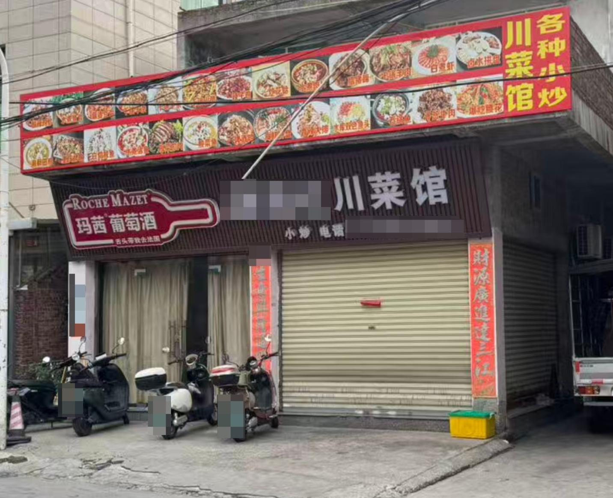
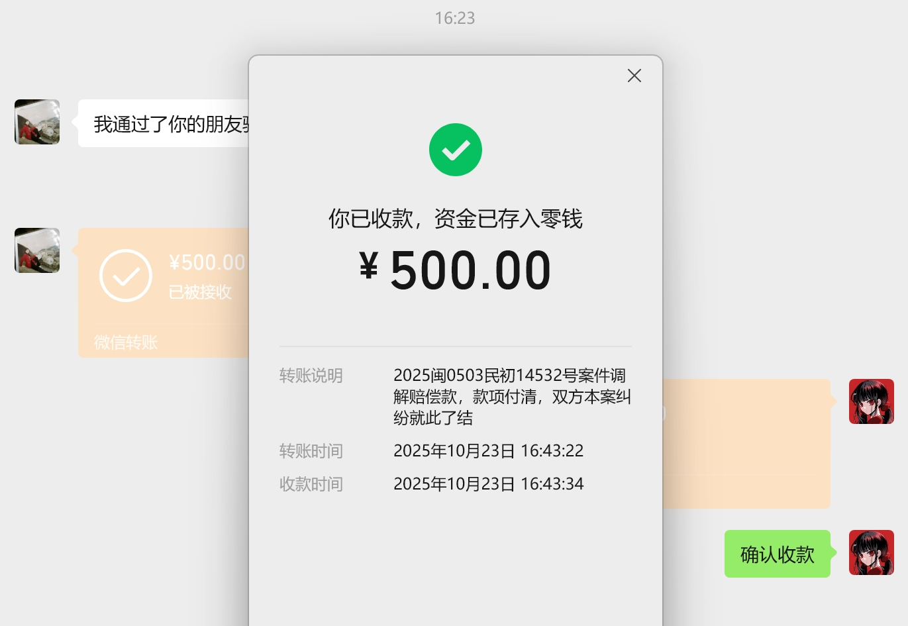

# 起诉美团案后续 - 美团缺席，商家和解

到了下午 _15:00开庭时间_ **两被告**（商家、丑团）**都没到**

法官说这个没法开庭，因为**商家**那边**未送达到**，说是**搬走了**。美团送达到了但是没人来。  
我问她那为什么还有船票？说今天开庭的？**她说她也不知道。**  
法院让我去登报找商家，200元自费，30天还未联系到就当作已送达，之后还要过15天举证期，也就是最晚要一个半月以后才能开庭。

于是我打开美团看了下，店铺还在。  
我琢磨着那既然开着，那就必定要去商家地址**圣地巡礼**了，确认一下是不是真的搬走了。  
附件街坊邻居都很热情，都说这个店**上午还开着的**。

	

**打招牌上的电话，店家接了**，我说您这馆子什么时候营业呀？  
她说现在正在**处理一点事情**，没法确定时间。  
我说您这个店的地址是不是xxx路xxx号呀？我确认一下没有找错地方吧？她说没错是这里。  
我问她您店什么时候营业，有具体时间嘛？她说她在办一点事情，**一时半会是开不了了**。

于是我就准备先回家了，结果**半路上**法官打来电话，说**餐馆当事人**到了，愿不愿意**调解**？我也想见一见我的被告，以及看看他的态度。  
我说我**现在过去**行不？法官说你先看看**能不能接受调解方案**，赔**500(我诉请1000元的一半) + 撤诉**，能接受你就来，我觉得还行，**于是就去了**。

到了以后，等了一会，餐馆老板和法官都来了。哦吼，**原来办一点事情是在这里办呀？**  
我还想说要不然再加100吧，算作今天打车的路费。  
法官看上去是一个年轻女生，但态度很坚硬，说：刚才电话里说好的500就500。  
餐馆的**老两口**也不是省油的灯，老太太**扯着嗓子就开始吼**了：“你们年轻人blabla我都不想说你blabla我在这坐了几小时了blabla”  
但是老两口对着**法官**却是**另一幅面孔**，不吼也不叫，像极了**两只听话的乖孩子**。

对于这种**做错事不想反思，还先怪别人，我懒得和他们废话**，说了也听不进去。

- 我不想说你tm**不知道开庭时间吗？不知道准时到达吗？船票上黑纸白字写着是看不懂中文吗？**
- 我也不想和说我为了立案有多辛苦。
- 我也不想说他是**个体户营业执照所以我立案还得要他身份证号**，我东跑西跑的跑了一天才想办法搞到他的身份证号。
- 我也不想说我为了确认他店到底还在不在所以**亲自去他那边**，走遍了**他附近的邻居**。

之后就转账了，完了以后老两口走人了。

	

法官还要复印一下我的身份证，我顺便问了下**美团那边的人有来吗**？  
她说有来一个**员工**递了一堆**材料**，上面是什么**我售后次数太多了**，但她拒收了。  
我猜测大概一是现在超过了举证期，二是美团公司应该也没有给他被告代理人的身份吧，三是——他迟到了。  
我其实挺**希望**那个法官当时能**收下这堆材料**的，来看看我到底有什么**所谓的“罪证”**，来看看他们的**垃圾风控**到底是怎么**判定**的。

这事最后就这样：  
我一圈折腾下来，**美团没付出任何代价**，我在被老太太嚷了一顿之后拿了500。  
我不缺这 500。我真正要的，是一个**认错的态度**。  
如果当时态度硬一点，坚持开庭，也许至少能和美团当面掰扯，哪怕是代理人也好。  
但转念一想：以后**彻底不会再用他们家的任何产品**——那这事，也就过去算了。

作为一个码农，我把一切都看的非常注重逻辑，但这个世界上，**逻辑往往不是第一位的**。

- 按照逻辑，双方就应该按时到场。
- 按照逻辑，我吃到生肉，商家就应该承担责任。
- 按照逻辑，我作为一个月消费五六千的用户，美团应该承担起平台的责任，而不是在这里宰熟或者是用它那智障一般的风控算法判定我“账户异常”。
- 按照逻辑，任何一个普通用户都不应该被平台随意欺负。
- 按照逻辑，法律不应该是摆设，而应该是保护弱者的工具。
- 按照逻辑，市场监督管理局在收到我的书面材料后，早应该去核查商家了。

但是在这里，现实往往并不符合逻辑：开庭迟到、商家态度恶劣、美团推卸责任、法律程序冗长、监管部门至今未答复，店还是好好的开着。
