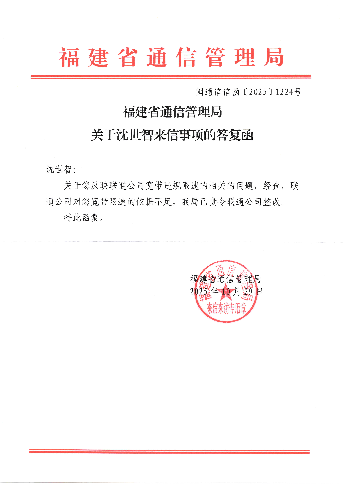

# 【后续 4】福建省通信管理局：已责令泉州联通整改

> 相关专题：[#泉州联通限速案](/#泉州联通限速案)

> 关于您反映联通公司宽带违规限速的相关的问题，经查，联通公司对您宽带限速的依据不足，我局已责令联通公司整改。特此函复。

	

举报信+履行法定职责申请书是在2025年9月4日签收的，回复挂号信是今天（2025年11月3日）收到的，历时将近两个月。

我已经继续申请政府信息公开，等有结果了会再更新。
