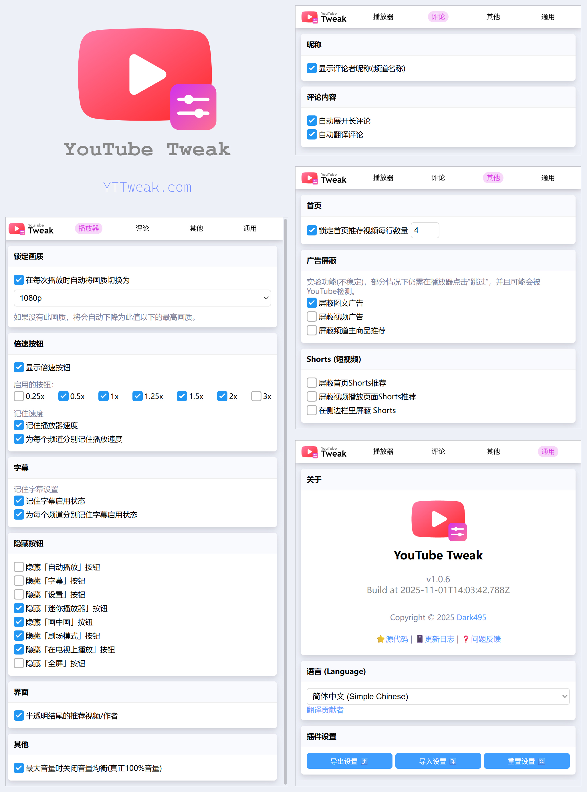
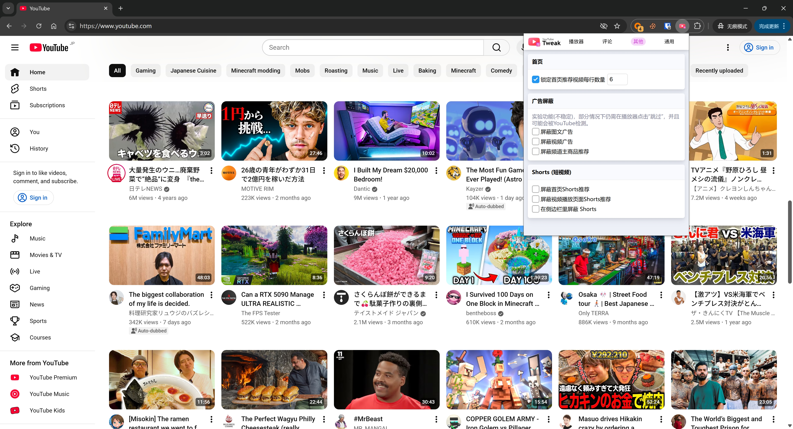
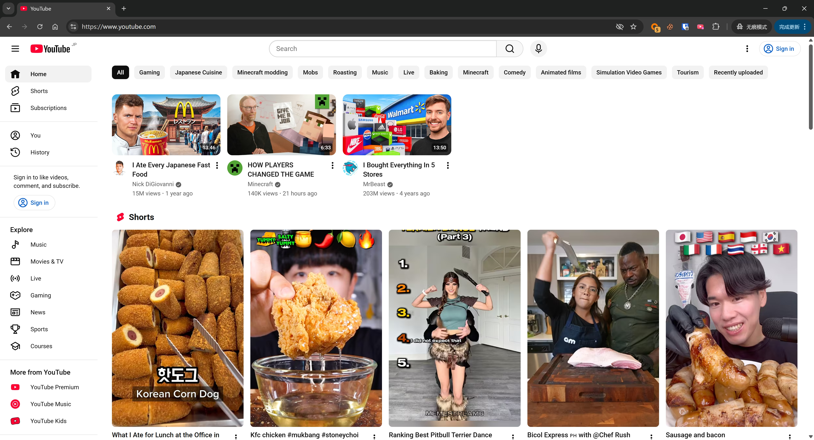
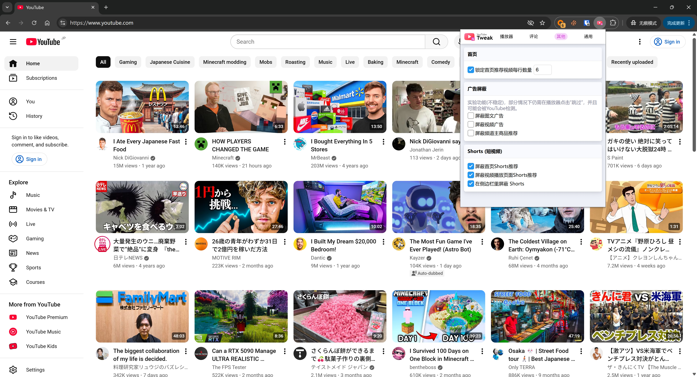
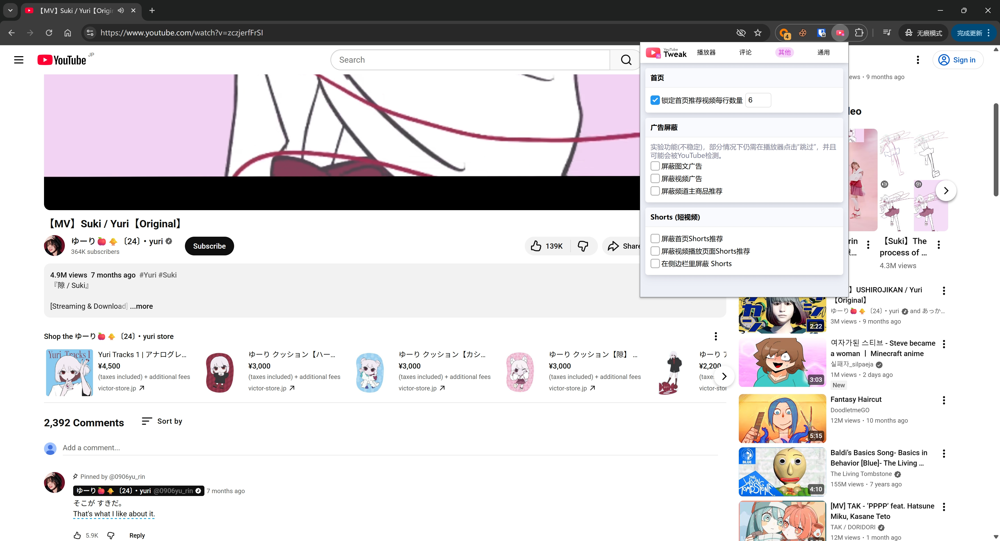
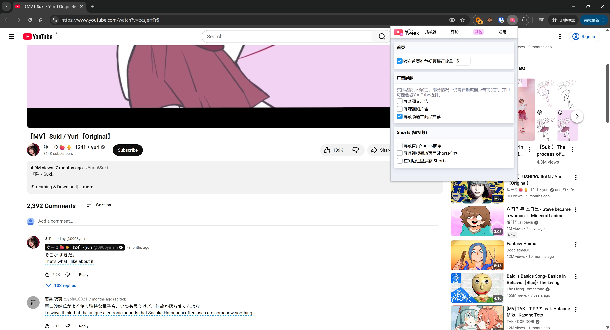
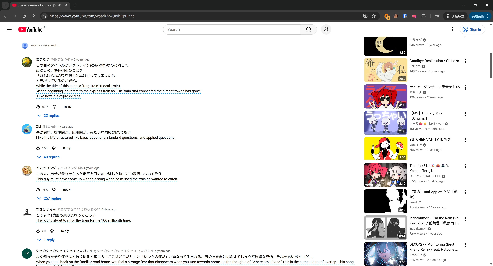
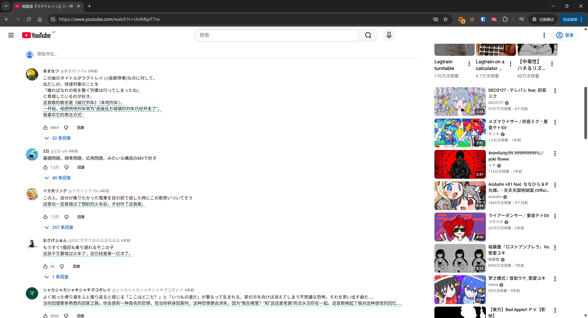
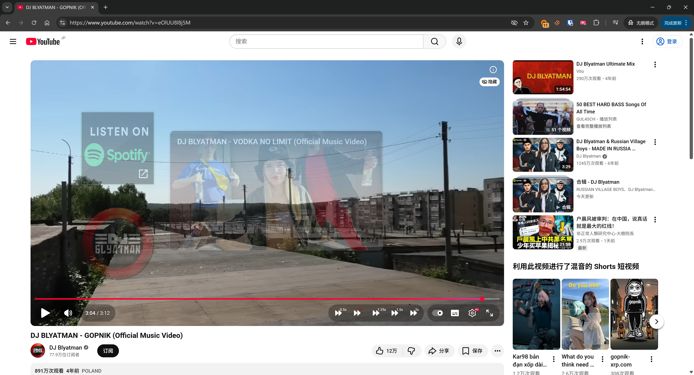

# 制作了一个YouTube的浏览器扩展 —— YouTubeTweak，以解决一些使用体验问题

## 为什么会有这个东西？

我是一个**偏重度**的YouTube用户，是YouTube Premium的长期订阅者，主要还是用 **PC Web** 版本。平时听歌以及看视频都在YouTube上完成。

但YouTube的有些东西着实让我不爽，比如：

- **_YouTube的画质并不固定：_** 画质是根据YT判定的网络质量自动调整的，但不太聪明。导致有时候明明网络很好，但画质却莫名其妙地变低了。
- **_切换视频的播放倍速需要点击至少三次：_** 设定按钮 -> 播放速度 -> 选择倍速。
- **_不会记住每个频道的播放倍速：_** 我在看影片时，通常使用1.5x，而听歌必然是1x，但YouTube不会记住每个频道的播放倍速，这让我必须每次都手动调整倍速。
- **_不会记住每个频道的字幕启用状态：_** 有些视频是既有内嵌字幕，又有CC字幕，对于已有内嵌字幕的视频，当然没必要开启CC字幕，但YouTube不会记住每个频道的字幕启用状态，这让我必须每次都手动开启/关闭CC字幕。
- **_一堆没用的按钮：_** 我希望隐藏某些在播放器上的按钮，比如“迷你播放器”、“画中画”、“剧场模式”、“在电视上播放”等我完全用不到的按钮。
- **_结尾的“片尾画面”：_** 通常是一些作者的其他视频推荐，会遮挡视频的最后几秒钟并且无法关闭 _（不过最近更新以后可以关闭了）_
- **_强制且无法关闭的音量均衡：_** YouTube会自动调整影片的音量大小以实现一个均衡的效果，但有些时候这个算法好像不太聪明，视频音量会过小。 _（最近更新终于可以让用户选择是否开启音量均衡了）_
- **_不会显示评论者的昵称：_** 自从某次更新后，所有人的评论都`只显示用户名`，只有点用户名进去才能显示昵称（或者说频道名）
- **_评论折叠以及翻译：_** 过长的评论必须手动点一次展开，并且翻译也是必须手动点击一下翻译按钮。
- **_首页推荐强制一行三个视频：_** 自从某次更新后，首页的视频布局从`四个`变为了`三个`，让老用户很难受。
- **_广告：_** 如果你没开Premium，会有视频广告+推荐位随机图文广告。且不论是不是Premium，在视频下方也会出现视频作者推荐的一些购物广告（比如周边什么的）
- **_短视频：_** 我不希望在PC上沉迷于短视频，我希望能在PC上彻底隐藏Shorts。

---

作为一个码农，我想着手解决这些问题，至少让自己用的舒服一点。

我采用了最简单便捷的方式来处理这些问题，这个项目一开始只是一个UserScript，在[Github](https://github.com/xlch88/YoutubePlus)和[GreasyFork](https://greasyfork.org/zh-CN/scripts/486375)上发布。

后来觉得 UserScript 开发体验不太好，并且也想试着学习开发一个浏览器扩展，**于是后面就改成了浏览器扩展的形式**。

## 浏览器扩展程序

在花了一段时间学习如何开发浏览器扩展，并且重构了代码以及自行测试了数月后，终于完成了一个 _我自己觉得可以公开发布的版本_。

这个扩展的名字叫做 **YouTubeTweak**，目前已经在这些平台通过了测试并发布：

- [Chrome 网上应用店](https://chromewebstore.google.com/detail/malfbchbmmlhkjjbepjodfkmnbngckoi)
- [Firefox 附加组件网站](https://addons.mozilla.org/firefox/addon/youtube-tweak)

_Edge暂时没有发布，<del>因为我安装完Windows的第一件事就是彻底卸载Edge浏览器。</del>_  
_（后续看情况可能会测试并发布。_

源代码仓库：https://github.com/xlch88/YoutubeTweak  
域名：https://yttweak.com/ (目前还是什么东西都没有，我还没制作网站)

## 功能

一张图概括这个插件的**功能以及UI：**

以及一些**功能实际的样子：**

### 改首页每行视频数量

### 隐藏Shorts

### 隐藏频道主购物推荐

### 显示评论昵称、翻译

### 隐藏多余按钮、添加一键倍速按钮、半透明片尾画面

## 关于开发

这个项目是出于提升和我有同样困扰的用户的使用体验的目的而开发的，我不准备进行任何商业化或追踪器植入，确保代码的干净。

整体使用 `TypeScript + Vue + WXT` 进行开发，全手写 SCSS 样式，未使用任何UI框架。

整体插件功能模块化，每个功能都分成了单独的模块，方便后续维护和扩展。

我希望有更多人能参与到这个项目中来，将你的想法变成现实。  
也欢迎参与代码的优化和审计，让我知道我哪里写得不够好。

如果你有兴趣参与这个项目，请访问项目的GitHub仓库：[https://github.com/xlch88/YoutubeTweak](https://github.com/xlch88/YoutubeTweak)

## 最后

如果你觉得这个插件对你有帮助，欢迎在 <u>**Github给我一个⭐️ 以及 在扩展商店给我一个好评**</u> ，让我知道有人在使用这个插件。

以及，这个项目的多语言翻译来自我的几位朋友的帮助，非常感谢他们。  
如果你也愿意帮忙翻译成其他语言，请在Github仓库中提交PR，或者联系我。

谢谢大家！
