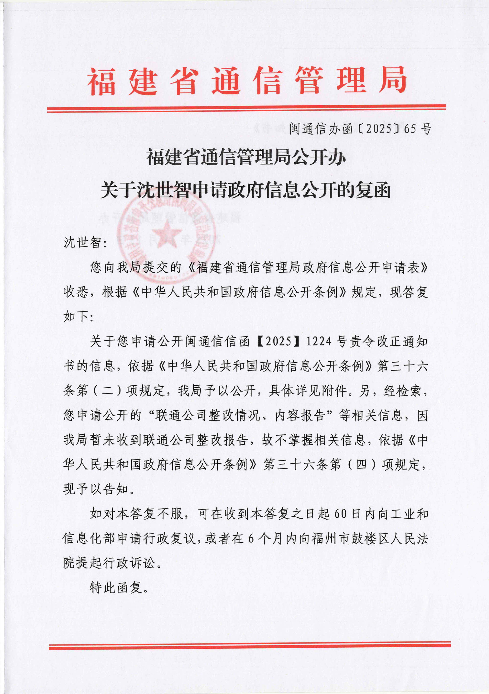
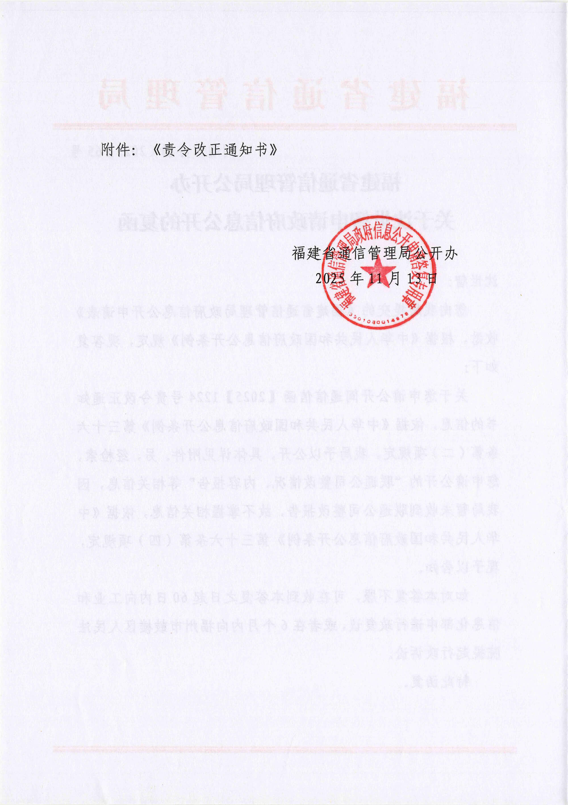
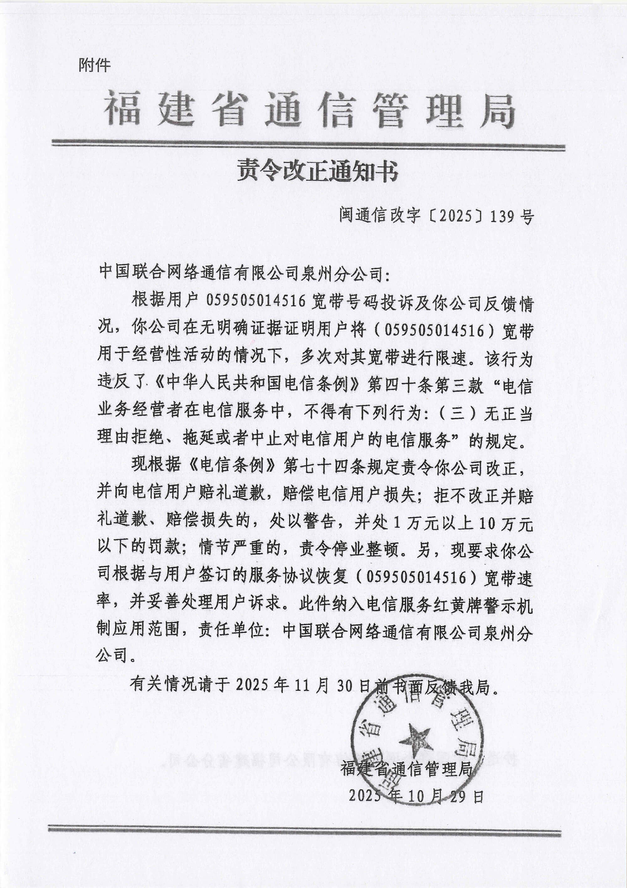
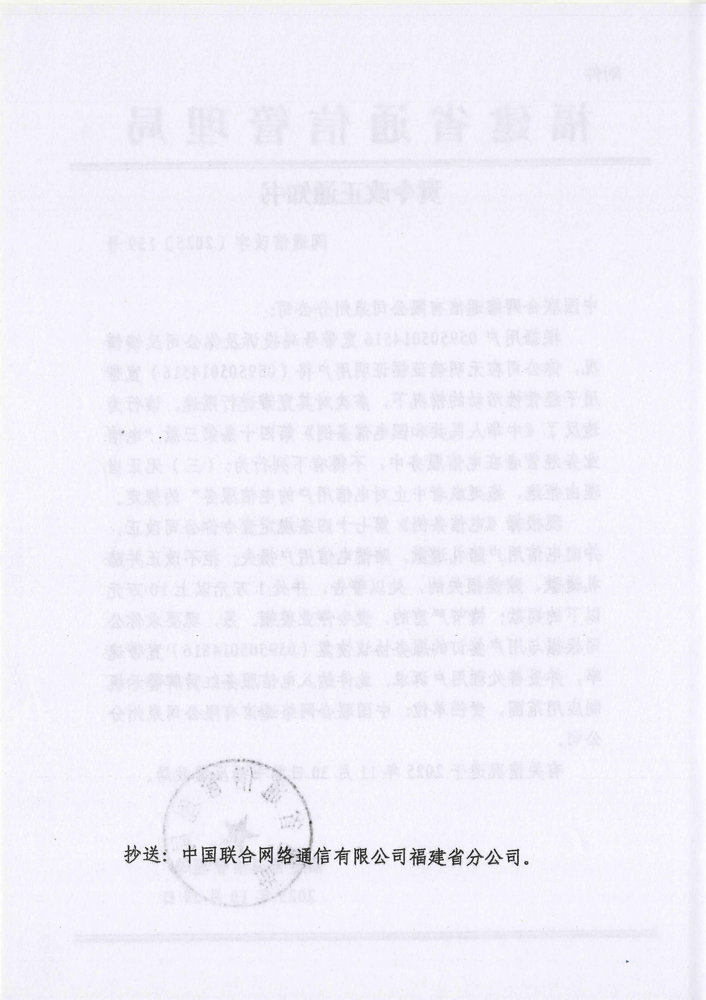
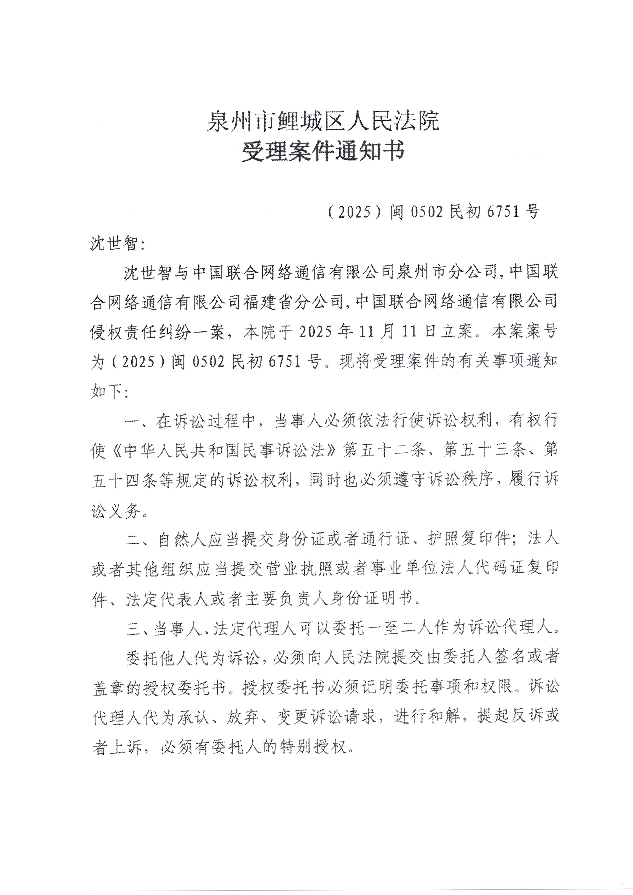

# 【后续5】我申请福建通信管理局公开对泉州联通的责令整改内容，结果来了

> 相关专题：[#泉州联通限速案](/#泉州联通限速案)

> &emsp;&emsp;关于您申请公开闽通信信函【2025】1224号责令改正通知书的信息，依据《中华人民共和国政府信息公开条例》第三十六条第（二）项规定，我局予以公开，具体详见附件。  
> &emsp;&emsp;另，经检索，您申请公开的“联通公司整改情况、内容报告”等相关信息，因我局暂未收到联通公司整改报告，故不掌握相关信息，依据《中华人民共和国政府信息公开条例》第三十六条第（四）项规定，现予以告知。

> 中国联合网络通信有限公司泉州分公司：  
> &emsp;&emsp;根据**用户059505014516宽带号码投诉**及**你公司反馈情况**，你公司在**无明确证据证明**用户将（059505014516）宽带**用于经营性活动**的情况下，**多次**对其宽带进行限速。  
> &emsp;&emsp;该行为违反了《中华人民共和国电信条例》第四十条第三款“电信业务经营者在电信服务中，不得有下列行为：（三）无正当理由拒绝、拖延或者中止对电信用户的电信服务”的规定。  
> &emsp;&emsp;现根据《电信条例》第七十四条规定**责令你公司改正，并向电信用户赔礼道歉，赔偿电信用户损失**；  
> &emsp;&emsp;**拒不改正并赔礼道歉、赔偿损失的，处以警告，并处1万元以上10万元以下的罚款；情节严重的，责令停业整顿**。  
> &emsp;&emsp;另，现要求你公司根据与用户签订的服务协议**恢复**（059505014516）宽带速率，并**妥善处理用户诉求**。**此件纳入电信服务红黄牌警示机制应用范围**，责任单位：中国联合网络通信有限公司泉州分公司。

---

## 另外：关于泉州联通对我的人格权侵害

对于泉州联通**偷拍我家**、**将我家照片在公司群随意传播**、**污蔑我“经营性使用”**、**上我家堵门**、**肆意限速对我生活影响等** `人格权侵害的行为`

我已另外立案，并已经受理，案号：(2025)闽0502民初6751号

### 诉讼请求

1. 请求判令被告就**未经原告允许，到原告住所进行偷拍的行为**，向原告进行书面、公开道歉；  
   <u>公开道歉须在被告的官方微信公众号（如“福建联通/福建联通发布/中国联通”）及原告办理宽带的营业厅(浔美营业厅)显著位置发布不少于7日的致歉声明，并在声明中明确写明侵权事实、致歉对象、致歉内容，未经原告同意不得删改；</u>
2. 请求判令被告就**将原告住所照片、影像资料在工作群传播**的行为，向原告进行书面、公开道歉(条件同上)；
3. 请求判令被告就**未经许可上门堵门、干扰原告正常生活**的行为，向原告进行书面、公开道歉(条件同上)；
4. 请求判令被告就**对原告宽带线路实施违法违规限速、造成原告工作生活受损**的行为，向原告进行书面、公开道歉(条件同上)；
5. 请求判令被告就**在信访回复、庭审中捏造并散布“原告经营性使用宽带”等不实言论**的行为，向原告进行书面、公开道歉(条件同上)；
6. 请求判令被告向原告赔偿精神损害抚慰金人民币 1000 元（具体金额由法院酌定）；
7. 请求判令被告承担本案全部诉讼费用。
8. 若被告未按期履行判决中关于公开道歉的义务，请求法院依法采取强制执行措施。
