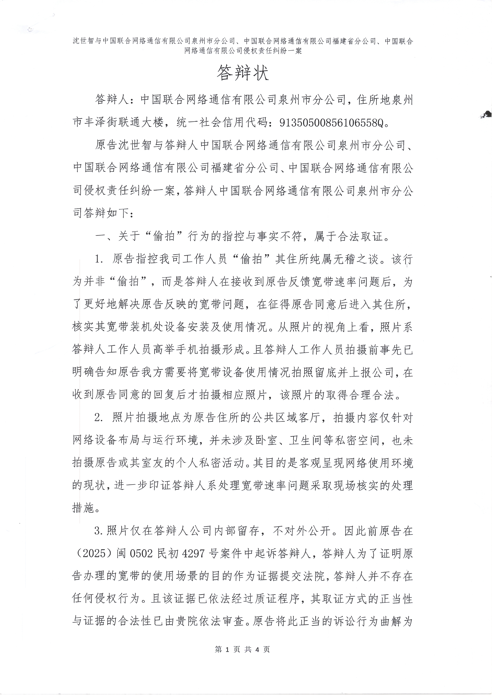
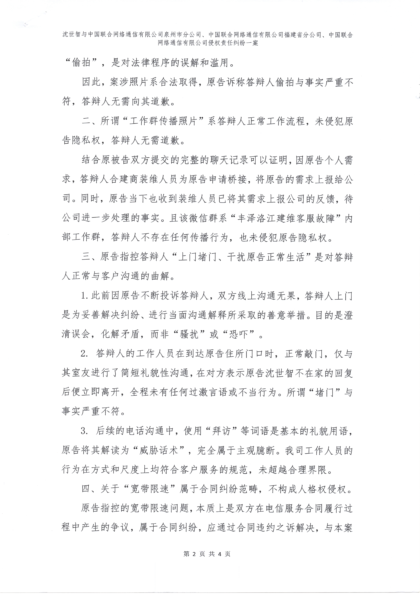
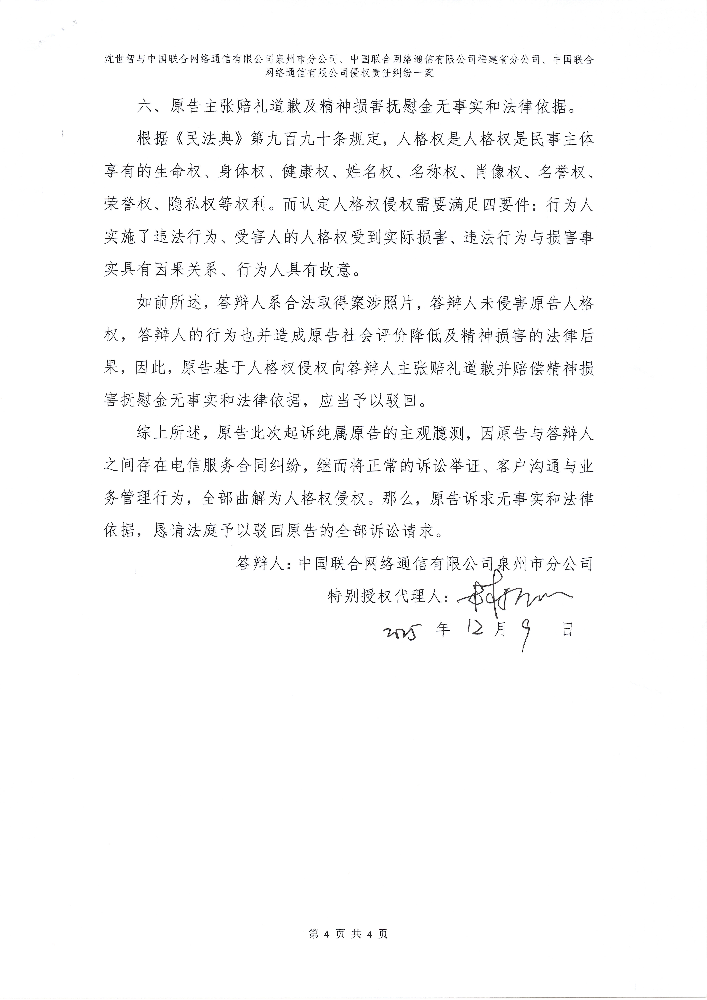

# 【后续7】看看泉州联通是多么的不要脸 - 厚颜无耻的答辩状

> 相关专题：[#泉州联通限速案](/#泉州联通限速案)
>
> 整个过程长达一年，非常有意思，从头看起，你可以感受到一个国企的丑恶嘴脸、一个普通人维权的艰难，还有司法的无奈。

这次我发一下我新开的人格权侵权案，被告**泉州联通的答辩状**。

如果你能够完整的看完 **#泉州联通限速案** 这个专题，应该知道我这次的人格权侵权案诉求是什么，以及为什么合理：

1. 请求判令被告就**未经原告允许，到原告住所进行偷拍的行为**，向原告进行书面、公开道歉；  
   <u>公开道歉须在被告的官方微信公众号（如“福建联通/福建联通发布/中国联通”）及原告办理宽带的营业厅(浔美营业厅)显著位置发布不少于7日的致歉声明，并在声明中明确写明侵权事实、致歉对象、致歉内容，未经原告同意不得删改；</u>
2. 请求判令被告就**将原告住所照片、影像资料在工作群传播**的行为，向原告进行书面、公开道歉(条件同上)；
3. 请求判令被告就**未经许可上门堵门、干扰原告正常生活**的行为，向原告进行书面、公开道歉(条件同上)；
4. 请求判令被告就**对原告宽带线路实施违法违规限速、造成原告工作生活受损**的行为，向原告进行书面、公开道歉(条件同上)；
5. 请求判令被告就**在信访回复、庭审中捏造并散布“原告经营性使用宽带”等不实言论**的行为，向原告进行书面、公开道歉(条件同上)；
6. 请求判令被告向原告赔偿精神损害抚慰金人民币 1000 元（具体金额由法院酌定）；
7. 请求判令被告承担本案全部诉讼费用。
8. 若被告未按期履行判决中关于公开道歉的义务，请求法院依法采取强制执行措施。

对于这个答辩状，我的评价是：

### 简直厚颜无耻！

我自己看到这个答辩状的时候，真的是**无语凝噎**。我不知道是**多无耻才能写出这玩意**。  
我不知道泉州联通到底脑子是有多抽，才能让**林梦瑶**写出这种答辩状，还是说这答辩状是泉州联通自己写的？

我觉得这份答辩状可以作为**厚颜无耻的范本**，以后大家可以拿来学习。

以下是OCR识别原文：

---

	<small>沈世智与中国联合网络通信有限公司泉州市分公司、中国联合网络通信有限公司福建省分公司、中国联合网络通信有限公司侵权责任纠纷一案</small>
	 
	<h1>答辩状</h1>

&emsp;&emsp;答辩人：中国联合网络通信有限公司泉州市分公司，住所地泉州市丰泽街联通大楼，统一社会信用代码：91350500856106558Q。

&emsp;&emsp;原告沈世智与答辩人中国联合网络通信有限公司泉州市分公司、中国联合网络通信有限公司福建省分公司、中国联合网络通信有限公司侵权责任纠纷一案，答辩人中国联合网络通信有限公司泉州市分公司答辩如下：

### 一、关于“偷拍”行为的指控与事实不符，属于合法取证。

1. 原告指控我司工作人员“偷拍”其住所纯属无稽之谈。该行为并非“偷拍”，而是答辩人在接收到原告反馈宽带速率问题后，为了更好地解决原告反映的宽带问题，在征得原告同意后进入其住所，核实其宽带装机处设备安装及使用情况。从照片的视角上看，照片系答辩人工作人员高举手机拍摄形成。且答辩人工作人员拍摄前事先已明确告知原告我方需要将宽带设备使用情况拍照留底并上报公司，在收到原告同意的回复后才拍摄相应照片，该照片的取得合理合法。
2. 照片拍摄地点为原告住所的公共区域客厅，拍摄内容仅针对网络设备布局与运行环境，并未涉及卧室、卫生间等私密空间，也未拍摄原告或其室友的个人私密活动。其目的是客观呈现网络使用环境的现状，进一步印证答辩人系处理宽带速率问题采取现场核实的处理措施。
3. 照片仅在答辩人公司内部留存，不对外公开。因此前原告在(2025)闽0502民初4297号案件中起诉答辩人，答辩人为了证明原告办理的宽带的使用场景的目的作为证据提交法院，答辩人并不存在任何侵权行为。且该证据已依法经过质证程序，其取证方式的正当性与证据的合法性已由贵院依法审查。原告将此正当的诉讼行为曲解为“偷拍”，是对法律程序的误解和滥用。

&emsp;&emsp;因此，案涉照片系合法取得，原告诉称答辩人偷拍与事实严重不符，答辩人无需向其道歉。

### 二、所谓“工作群传播照片”系答辩人正常工作流程，未侵犯原告隐私权，答辩人无需道歉。

&emsp;&emsp;结合原被告双方提交的完整的聊天记录可以证明，因原告个人需求，答辩人合建商装维人员为原告申请桥接，将原告的需求上报给公司。同时，原告当下也收到装维人员已将其需求上报公司的反馈，待公司进一步处理的事实。且该微信群系“丰泽洛江建维客服故障”内部工作群，答辩人不存在任何传播行为，也未侵犯原告隐私权。

### 三、原告指控答辩人“上门堵门、干扰原告正常生活”是对答辩人正常与客户沟通的曲解。

1. 此前因原告不断投诉答辩人，双方线上沟通无果，答辩人上门是为妥善解决纠纷、进行当面沟通解释所采取的善意举措。目的是清误会，化解矛盾，而非“骚扰”或“恐吓”。
2. 答辩人的工作人员在到达原告住所门口时，正常敲门，仅与其室友进行了简短礼貌性沟通，在对方表示原告沈世智不在家的回复后便立即离开，全程未有任何过激言语或不当行为。所谓“堵门”与事实严重不符。
3. 后续的电话沟通中，使用“拜访”等词语是基本的礼貌用语原告将其解读为“威胁话术”，完全属于主观臆断。我司工作人员的行为在方式和尺度上均符合客户服务的规范，未超越合理界限。

### 四、关于“宽带限速”属于合同纠纷范畴，不构成人格权侵权。

&emsp;&emsp;原告指控的宽带限速问题，本质上是双方在电信服务合同履行过程中产生的争议，属于合同纠纷，应通过合同违约之诉解决，与本案的人格权侵权纠纷系不同法律关系。且原告已就“宽带限速”问题向贵院起诉，案号:(2025)闽0502民初4297号，目前该案正在二审阶段，一审判决并未生效，无法作为本案定案依据。

&emsp;&emsp;退一步讲，答辩人对网络进行管理，是基于与原告之间签订的电信服务合同，答辩人采取限速措施是针对原告流量使用情况及宽带使用场景所采取的措施，以便提示原告规范使用宽带。且限速本身并未影响原告家庭正常上网需求，答辩人并未停止向其提供宽带服务。该行为是否违约，已在另外中审理,但其本身并不直接构成对原告名誉隐私等人格权的侵害。

### 五、关于“捏造不实言论”的指控是对我方合理怀疑的误读。

1. 答辩人在信访回复及另案庭审中提出原告可能“经营性使用宽带”，是基于其家中部署有大量专业网络设备、家中有人全天直播等客观事实所产生的合理怀疑。原告在案号(2025)闽 0502 民初 4297号提交的起诉状中自述“家中安装近 20 个画面的 1000 万像素高清监控摄像头，实时上传录像到云端。家中有人员进行高码率的合法游戏直播活动。家中与原告办公室定期进行重要数据备份传输....家中有多种物联网设备持续上传日志与图像等非家庭日常生活应用场景使用”也可以印证答辩人的合理怀疑。答辩人就此向法庭和相关部门进行说明，目的是为了证明答辩人网络管理行为的正当性。
2. 该陈述发生在特定的法律诉讼程序和行政程序信访答复中:即使双方对此事实认定存在争议，亦属于诉讼对抗中的正常范畴，不具有“捏造并散布”以损害原告名誉为目的的违法性。
3. 关于原告注册的公司信息，该信息为工商公开信息，答辩人在庭审中引用是为了佐证原告存在经营性使用宽带的情形，并非恶意泄露其隐私僖。

### 六、原告主张赔礼道歉及精神损害抚慰金无事实和法律依据。

&emsp;&emsp;根据《民法典》第九百九十条规定，人格权是人格权是民事主体享有的生命权、身体权、健康权、姓名权、名称权、肖像权、名誉权荣誉权、隐私权等权利。而认定人格权侵权需要满足四要件:行为人实施了违法行为、受害人的人格权受到实际损害、违法行为与损害事实具有因果关系、行为人具有故意。

&emsp;&emsp;如前所述，答辩人系合法取得案涉照片，答辩人未侵害原告人格权，答辩人的行为也并造成原告社会评价降低及精神损害的法律后果，因此，原告基于人格权侵权向答辩人主张赔礼道歉并赔偿精神损害抚慰金无事实和法律依据，应当予以驳回。

&emsp;&emsp;综上所述，原告此次起诉纯属原告的主观臆测，因原告与答辩人之间存在电信服务合同纠纷，继而将正常的诉讼举证、客户沟通与业务管理行为，全部曲解为人格权侵权。那么，原告诉求无事实和法律依据，恳请法庭予以驳回原告的全部诉讼请求。

答辩人:中国联合网络通信有限公司泉州市分公司 
特别授权代理人：林梦瑶 
2025年12月9日

扫描件原件

[PDF版本](./assets/2025-12-14_QuanzhouUnicom_dabian/pdf/泉州联通厚颜无耻的答辩状%20-%20沈世智（2025）闽0502民初6751号.pdf) <----

以下是图片：

