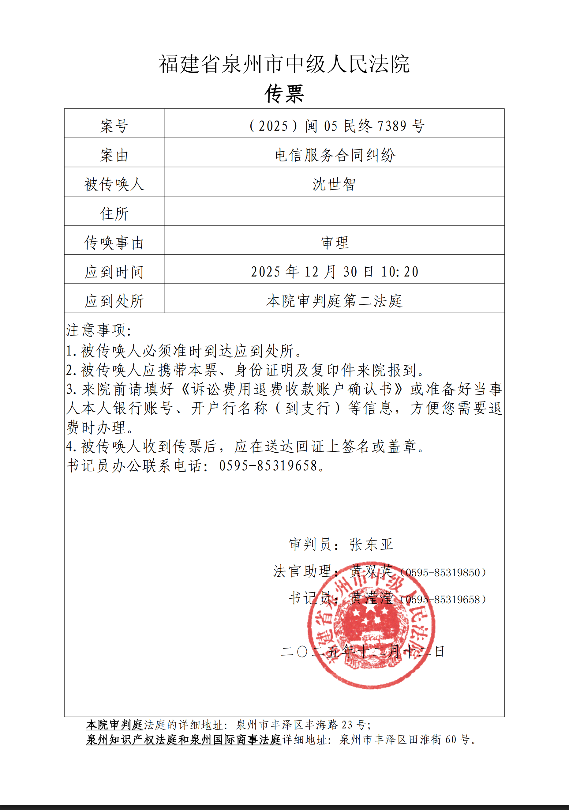

# 【后续 8】泉州联通限速案二审开庭 | 时间 2025-12-30 10:20

> 相关专题：[#泉州联通限速案](/#泉州联通限速案)
>
> 整个过程长达一年，非常有意思，从头看起，你可以感受到一个国企的丑恶嘴脸、一个普通人维权的艰难，还有司法的无奈。

# 欢迎旁听

庭审直播大概率还是不会有的，所以欢迎大家去泉州中院现场监督、现场旁听。

时间：**2025年12月30日（星期二）上午10:20**

### 注意事项：

1. 请**不要忘记带身份证**
2. 在审判楼，在安检凭**身份证和传票**（下方图片）进入楼内
3. 中院**旁听席的椅子很难受**，是90°的直角实心纯木制，久坐可能会较为痛苦，如果无法接受请酌情考虑是否要来。

# 快速总结当前进展

## 限速案：

**二审中，2025年12月30日10时20分在泉州中院开庭。**

目前被告还没向中院提交律师委托授权书(就是请律师)，疑似想缺席或自己上(?)。

上诉二审是因为原告对于以下不服：

- **未判令被告解除限速**(被告提交证据说开庭前原告带宽已达到合同要求，但实际上流程不规范，未做到通知)；
- **未判令被告承诺以后不再限速**(判决书说我没证据证明以后被告一定会再给我限速，但其实是有的)；
- **赔偿金额不对**(我要求的是从25年1月截止恢复限速期间的所有套餐费，粗略估计58\*8=464，并提出多项对我的影响以此佐证此金额合理)，但审判员却只判58块钱？简直侮辱人了，我完全可以申请退一赔三的；
- **未让被告承担全部诉讼费**(诉讼费25，让我承担20对方承担5块？明显过错方是被告，事情是因他而起，但我知道一审我只是半赢，所以让我承担部分诉讼费也能理解，但20这个比例也太多了吧？)；
- **原告全程被程序不正义(对,这个才是我必然二审的原因)**，原告几乎被堵嘴(不停打断)说不出完整内容、仅让被告律师完整发言、书记员漏记原告笔录等等，我不想再赘述这段难受的经历，可以看:  
  2025-10-31 [原告沈世智在一审庭审时发生的程序不正义事实](./2025-10/2025-10-31_NFWX_1.md)

## 侵权案

**一审中，已开完庭，最晚一审截止时间2026年2月11日。**

被告目前未对我**庭后** _(不得不,因为是开完庭以后才去做的检查)_ **逾期提交**的精神科病历**证据做出质证答复**。

审判员心里是怎么想的不清楚，最坏结果就是这几种：

- **审判员一直拖到简易程序截止日期前几天才结**
- **被告一直不提供质证意见，然后在简易程序截止的前几天突然提交，让我反驳的时间极为仓促**
- **拖完了简易程序的3个月，转普通程序，变成6个月**

最好就是：  
**被告提交完质证然后原告提交反驳以后过几天就能一审完结。**  
(但从语气里感觉希望渺茫)

---

以上只是简短总结，全程细节请看专题，也可看我在论坛发的贴子：  
[#泉州联通限速案](/#泉州联通限速案)

我很累，我不希望谁能理解我现在的感受，但我真的很累，很想快点结束这一切。

我有工作，我是个死码农，我不是某些人想象的吃饱了撑着的无业游民。我也有我的生活要过，我真的又累又忙。

但我绝对不会因为累所以妥协，我势必要让做出这些丑恶行为的泉州联通付出代价。  
即便只能伤其皮毛，我也会坚持到底。  
至少，我做了，我会对这件事问心无愧。而不是让这件破事变成一直压在心里的石头，因为这样的石头在我心里已经压了不少了。
