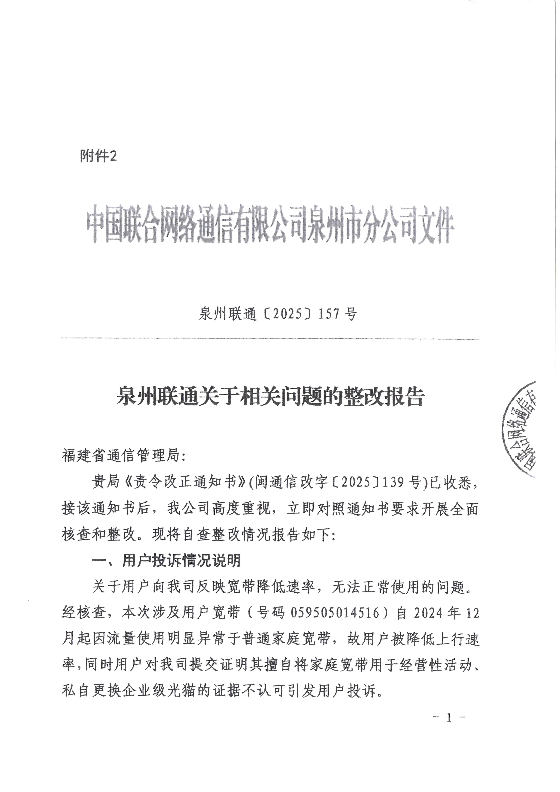
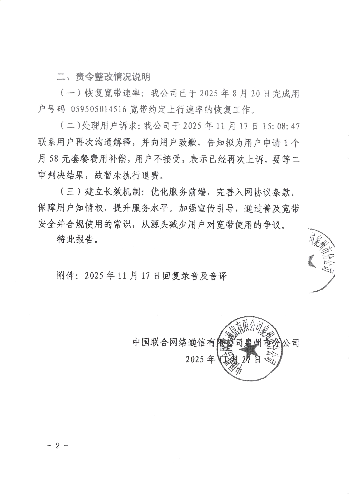
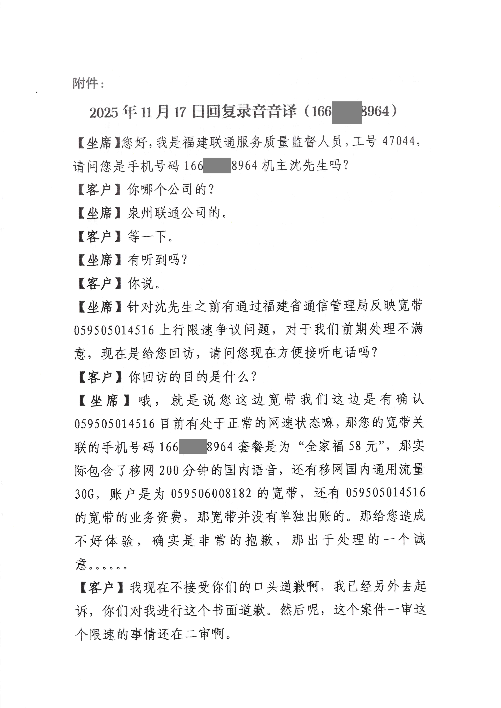
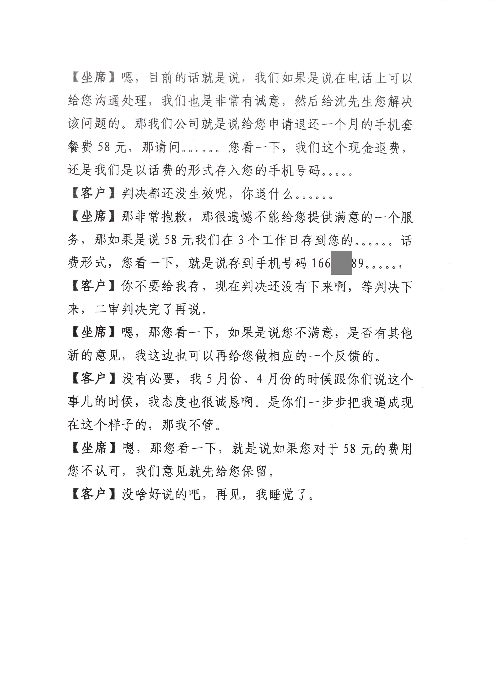
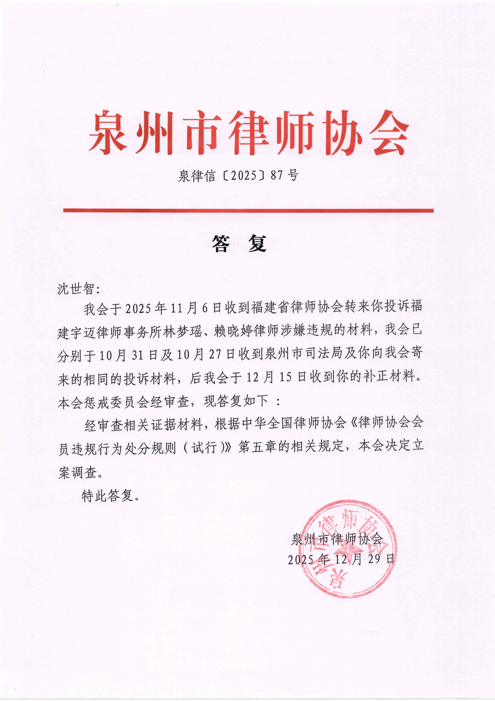

# 【后续 9】泉州联通限速所谓整改:优化"劣质"用户 | 二审开庭:责任全在合建商 | 福建宇迈律师林梦瑶被律协立案

> 相关专题：[#泉州联通限速案](/#泉州联通限速案)
>
> 整个过程长达一年，非常有意思，从头看起，你可以感受到一个国企的丑恶嘴脸、一个普通人维权的艰难，还有司法的无奈。

这些事情都是在 **2025年12月30日 同一天** 发生的：

- 早上10:20，泉州联通限速案(2025闽0502民初4297号) 的 二审(2025闽05民终7839号) 开庭
- 下午，我收到了再次申请信息公开后，福建通信管理局发来的文件：  
  **泉州联通[2025]157号**：《泉州联通关于相关问题的整改报告》
- 下午，我亲自去了趟泉州市律师协会(29号通知我已经立案)，拿到了文件：  
  **泉律信[2025]87号**：泉州联通的**代理律师** 林梦瑶、赖晓婷 被立案调查的通知书

这两天状态不是很好，不想写太长的东西，于是拖到了今天(26-01-02)才更新。

## 泉州联通的整改报告

只能说，像我看到他们的信访回复一样无语。  
我不知道谁给它们的勇气，能如此的颠倒黑白、避重就轻、睁眼瞎。  
**是因为自己是“国企”所以什么都不怕？说什么都可以这么不要脸？**

### 用户投诉情况说明是这么写的：

> ……故用户被降低上行速率，**同时用户对我司提交证明其擅自将家庭宽带用于经营性活动、私自更换企业级光猫的证据不认可引发用户投诉。**

是吗？我投诉的时候您还没搬出来 **“经营性使用”这口黑锅** 呢，又一次避重就轻、睁眼瞎。

### 责令整改情况是这么写的：

> （一）恢复宽带速率……  
> （二）处理用户诉求：…联系用户再次沟通解释，并向用户**致歉**，告知**拟为用户申请1个月58元套餐费用补偿**，用户不接受，表示已经再次上诉，要等二审判决结果，故暂未执行退费。  
> （三）建立长效机制：**优化服务前端，完善入网协议条款，保障用户知情权，提升服务水平。加强宣传引导，通过普及宽带安全并合规使用的常识，从源头减少用户对宽带使用的争议。**

### 我来翻译一下人话：

- 用户**投诉不是因为**我们这边做出了**违法违规行为**，而只是**对证据不认可罢**了。
- 宽带我们**恢复了**，但是我不说是怎么恢复的、为什么恢复，反正就是恢复了。  
  （实际上是怎么恢复的呢？被告自己在一审的时候说了，因为“**移机**(把联通的线从室内移到室外去了)”**所以自动恢复了**，对于此理由只能说**您心里自个清楚**哈。）
- 我们**道歉**了，还想给用户**补偿一个月的套餐费用58元**，用户不接受。  
  （**道歉了吗？没有**，直接一个**电话**打来说“**我们很抱歉**，愿意赔您58”，这就是道歉了呢？）  
  （**58**这个数是怎么来的？是**一审判的**。）

特别是第三条，**优化服务前端、加强宣传引导**？
我翻译一下哈，意思就是：

- 我们**不觉得**我们现在**乱限速有什么问题**，我们**不承认**有任何**违法违规**，都是**用户逼事太多**。
- 我们要在**入网协议里写清楚**，你上传多少GB就给你限速啦，**从源头堵住您嘴**呢。  
  但是入网协议我现场不给你书面的，您需要自己去联通APP的隐秘角落里看呢。  
  而且app里也不让你导出pdf打印，也没有 文件数字签名/时间戳等可验证措施（如《电子签名法》相关要求），您就只能认了。
- 就是**用户不合规**使用宽带**导致**的这次**投诉**，我们要对**自己的不要脸行为**“加强**宣传引导**”，让用户乖乖听话，不要再乱投诉我们了。
- 我们**不会解决我们自己的问题**，我们只会**让用户闭嘴**，不让这些用户**给管局添乱**了，**优化**掉这些“**劣质用户**”。

您品，您细品。

### PDF扫描件

[泉州联通所谓的整改及态度.pdf](./assets/2026-01-02_QuanzhouUnicom/pdf/泉州联通所谓的整改及态度.pdf)

## 泉州联通限速案二审开庭大致情况

简单四个字总结：**无聊至极**。

本来以为今天不开庭，因为传票上写的是“**审理**”而不是“**开庭**”。  
一般来说如果写的是“**审理**”就是**在开庭前进行一些讨论**什么的，只有**明确写“开庭”才是**开庭。

我在**前一天**(29号)还特意打电话给书记员确认了一下，被告**仍未提交律师授权委托书**。  
我**猜测**它们次日开庭要**缺席**了？还是想直接自己上？

不过距离开始的**前几分钟**，被告那边的人**还是来**了。  
联通的三个工作人员，加上他们的 **专属 御用** 代理律师 **林梦瑶**，一共四个人。

对于林梦瑶到来我感觉十分的**意料之外**，以及，**恶心**？  
之前因为 _**人身攻击、颠倒黑白，毫无道德可言**_ ，被我投诉。今天**才被**律师协会**立案**，这就跑来出庭了？  
我当时就想，这人真是不要脸到极点了。恶心他妈给恶心开门，恶心到家了。

时间到了，先是进行了“审理”。不过刚开始我就提出强烈异议，要求**林梦瑶回避**。  
当然是回避不了的，_不在可回避范围内_ ，法官助理也没同意。  
我说我知道，但是你必须**让我说**我的主张，并且**记录到笔录**里。  
泉州中院这次开庭**堵嘴**的意愿虽然没有一审的**杨鹏**和**吴柏雯**那么强烈，但是也很明显。  
我**强烈要求**以后，**才让我说**，并且记录下来。

之后开始质证我新提交的那三份证据：

> 1. **闽通信信函 (2025) 1224号《福建省通信管理局 关于沈世智来信事项的答复函》**  
>    证据来源：福建省通信管理局向原告出具的答复函  
>    证明内容及对象：
>     - 证明原告曾向福建省通信管理局投诉的事实；
>     - 进一步佐证被告对原告宽带限速事实依据不足；
>     - 进一步佐证原告宽带非经营性使用，所谓经营性使用是被告进行的污蔑。
> 2. **闽通信办函 (2025) 65号《福建省通信管理局公开办 关于沈世智申请政府信息公开的复函》**  
>    证据来源：福建省通信管理局公开办向原告出具的复函  
>    证明内容及对象：
>     - 证明原告曾向福建省通信管理局申请过信息公开；- 证明原告证据3获取的合法性；
> 3. **闽通信改字 (2025) 139号《责令整改通知书》**  
>    证据来源：福建省通信管理局向被告出具的责令整改通知书  
>    证明内容及对象：
>     - 证明被告违反《电信条例》，进一步佐证被告多次、反复对原告宽带进行限速；
>     - 进一步佐证被告所称“经营性使用”等不实言论的错误性；
>     - 证明被告被责令“进行改正、向用户赔礼道歉、赔偿用户损失”；

其实这也没什么好质证的，真实性就摆在那里，联通也没法反驳。

但是林梦瑶又开始**发功了**，对 _关联性和证明内容_ 进行**睁眼瞎式质证**：

- 这三份文件**无法证明原告宽带不是经营性使用**  
  （我：？你要不要听听看你在说什么，你到底有没有仔细看过内容）
- 福建管局那是**行政行为**，和本案(民事诉讼)属于**不同法律关系**，**所以没有半毛钱关系**  
  （我：有没有关系你心里没点B数吗？）
- 仅能证明**通信管理局做出了处理**，被告泉州联通**已经进行了“整改”**  
  （我：您整改了什么？恢复、赔礼、道歉，三件事您也就勉强做了第一件。）

我这次也没准备什么资料，也懒得准备，就直接脱稿回答了她的质证。  
因为我知道**对面是什么德行**，我当然是尽量做到**不要让对方浪费我的时间精力，以及影响到我的心情**。

之后竟然 **开庭了？** 法官助理说质证完了就开庭了，然后打电话喊法官来了。

### 然后就无语至极的开庭了

整个过程中，林梦瑶好像**完全没看过上诉状**一样，即便是我上诉状已经**明确点出**的问题，它也**睁眼瞎**、不要脸的回复。  
不知道是真的看都不看就上，还是故意睁眼瞎，故意来恶心人。

这让我庭审快结束前直接忍不住说了一句：  
**我觉得被告连我的上诉状都没看过，上诉理由已经能够全部反驳被告的主张，我不知道它在这胡言乱语什么。**

### 但是这次泉州联通想甩给 “外包” “合建商”

这次，林梦瑶再一次提到了“`合建商`”这个词。

并且说了一些这样的话：

- 合建商是**外包公司**
- 合建商**负责拉线装光猫，权利来自联通公司**
- 合建商的人**不是我们员工**

很明显，泉州联通想把责任**甩锅**给“合建商”这个所谓的**外包公司**。

突然对它们的“合建商”感觉到一丝同情，**毕竟被国企这么一甩锅，估计也挺惨的**。

### 完整的庭审**笔录**在我的**强烈要求**下，打印了一份给我。

但暂时**不能公开**。至于原因我现在也说不清楚，总之法院就是给我一种感觉，你公开就是违法了。  
可能需要我查阅一下相关法律，搞清楚以后才能决定要不要公开。

## 福建宇迈律师事务所 的 林梦瑶 被泉州律师协会立案调查

在经历了**调不到一审卷宗、庭审录像缺失**等一系列困难以后，时隔一个月，我终于是搞到了一份像样的补充材料。

我为什么要投诉林梦瑶？这里截取一段投诉信的原文：

> 1. 林梦瑶律师在2025年10月13日开庭时口无遮拦，直接当着`公开庭审、且有旁听人员`的情况下对我进行 **`人身攻击、诽谤`**，在`否定`我的病历`真实性`(觉得我造假)后，又继续称“**病历显示我有‘五年`精神疾病`史’**”
>
>     但病历上写的“目前病情”为“患者于`5年前出现郁闷`，兴趣减少，觉得疲惫无力......近期因为涉及与中国联通公司的一个官司，导致失眠、焦虑、压力大。”  
>     且西医诊断写的是“1.焦虑抑郁**状态** 2.非器质性睡眠障碍”
>     并无任何“精神疾病”的字样和诊断，“状态”一词也并不等于“精神疾病”。
>
>     林梦瑶律师的上述言论，已经严重`侵犯了我的人格尊严`，并对我造成了严重的`精神伤害`，且该言论已经被`庭审旁听人员记录传播`，对我的名誉造成了严重损害。
>
> 2. 林梦瑶律师在出庭时未穿律师袍，影响了律师职业形象。
> 3. 林梦瑶律师在未在举证期限前提交答辩状，而是在庭审当天才提交答辩状，严重违反了《最高人民法院关于民事诉讼证据的若干规定（2019修正）》相关规定，影响了庭审的正常进行以及原告的合法权益。
> 4. 林梦瑶律师在庭审过程中多次进行**违反常理的不诚实**辩论，如 “限速是由于**故障**产生的”，之后又改口“限速是**善意提醒**原告宽带使用不正常”，严重违反了《民事诉讼法》关于诚信原则的相关规定，影响了庭审的正常进行以及原告的合法权益。

真的，有那么一瞬间让我觉得，**律师这个职业，真的是这个世界上最不要脸的一群人**。

