# 关于二手打印机，你需要知道的坑

首先，非必要绝对不建议购买二手的打印机！  
因为你买来就是为了省事的，而不是像我一样坏了就自己想办法修，甚至读完了一本完整的维修手册。

目前我手头上一共有三台不同的打印机：

- Epson L8058: 喷墨 A4 仅打印 六色，一位已故朋友送给我的
- Epson L1455: 喷墨 A3+ 全功能 六色，咸鱼二手 ￥1200
- HP MFP179fnw: 激光 A4 全功能 四色，咸鱼二手 ￥1130

我是比较喜欢折腾的人，所以为了个人所需，才去特意挑选了型号比较旧、二手性价比较高的打印机。

以下是我总结出来的一些坑，供大家参考：

## 二手喷墨打印机的坑

这种打印机最贵的就是喷头。喷头坏了，或者用的太久老化，或者有瑕疵，基本上就等于报废了。

一般来说这种打印机很容易就能看出好坏，只需要打印四张/六张纯色测试页，就可以知道喷头怎么样。

### 但也有一些很难防的坑：

#### 喷头微堵：长时间不插电开机、不打印，喷头就会堵。

虽然有清洗功能，并且这个功能能解决大部分喷头堵塞的问题，但仍然无法解决某些墨水固化后真的清洗不掉的问题。  
例如我的那台L8058，现在打印比较细的线条或文字时，放大看会有类似“炸墨”的情况（你想打印的是一条纯正的直线，但打印出来的像是四分五裂的直线）  
视觉效果上就是字边缘看上去很糙，但对图片影响不大。

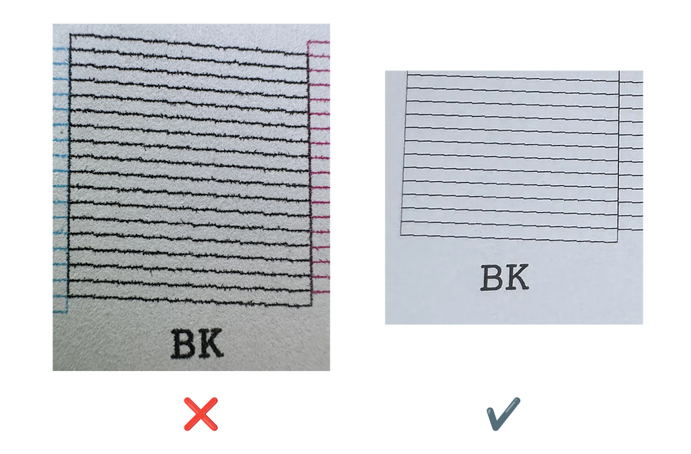

#### 喷头寿命

我购买的L1455，虽然计数器仅3000页，但这台机器实际上运行了很久了。  
打印测试页时，会出现缺一条线。只是缺少一条问题不大，日常使用看不出来区别。  
但如果你打印纯色或者是照片，可能就会很明显了。

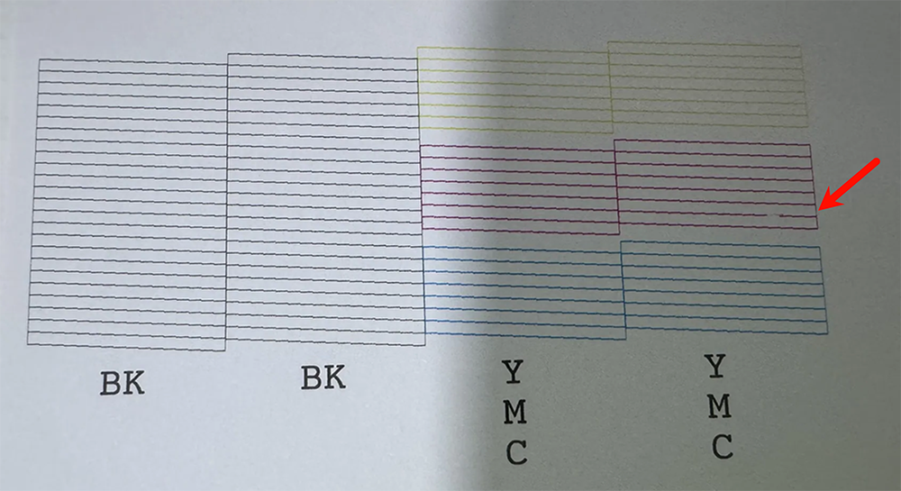

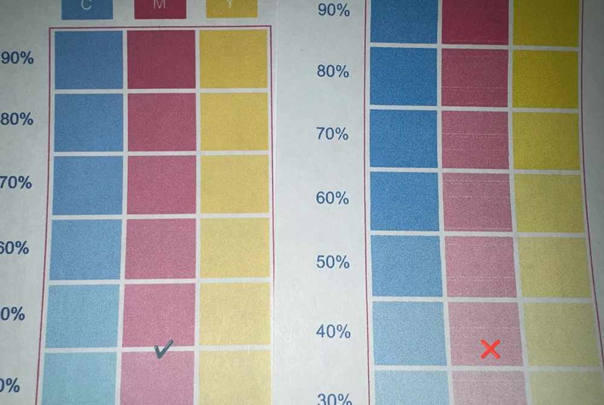

#### 零件老化

有些零件，特别是滚纸轮，可能会自然老化/进灰，导致的问题就是卡纸、两三张纸一起进纸的问题。  
你可能需要拆很多东西才能接触到那个坏掉的零件。

幸运的话用湿巾擦一擦然后再用不掉渣的纸擦干就能解决。  
但是如果很不幸，这东西就是老化到你怎么调教都会出问题，那就只能换，  
一般人很难折腾这些，虽然越老的打印机零件越好买，但想把这种比较精密的东西拆了再原样装回去也不是一件容易的事。

#### 立式进纸器

一次进两三张纸这种问题特别容易发生在立式进纸器(或者,后进纸器?)上（纸是斜着插在机器后方位置的，小型喷墨机一般都是这样），并且很难彻底排查出问题。  
可能是你的纸张有问题，可能是滚纸轮老化，可能是进纸导轨上有灰尘，可能是你放纸的方式不对。  
总之就是，你要注意姿势，姿势不对就可能出幺蛾子。

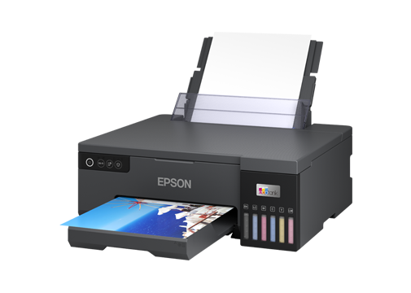

以及一个特别重要的问题：你千万别让小东西掉进进纸口或机器里，比如订书针、回形针之类的。  
掉进去就很难弄出来不说，也有可能给某些部件带来一些你看不出来的损坏，导致出现各种玄学问题。

## 二手激光打印机的坑

如果你想买二手，最重要的就是问清楚卖家，消耗品有没有质保，能质保多久。  
为什么？因为激光打印机除了消耗品，实际上就是一个空壳子了。

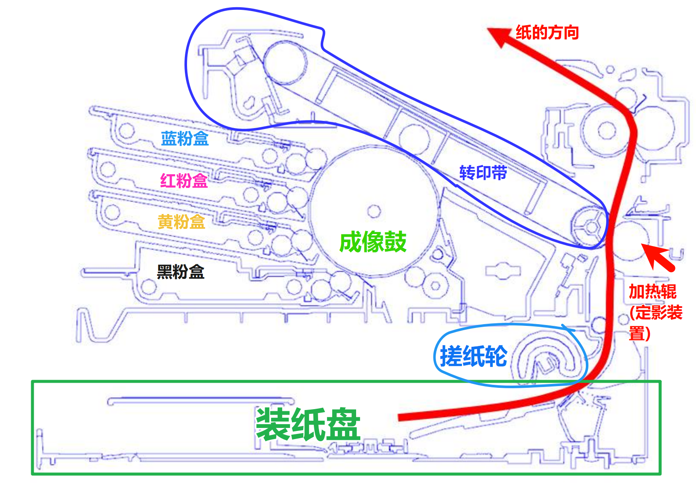

这种打印机的可维护部件较多，比起喷墨，要复杂得多。  
_特别符合那种大公司需要专门请个IT来维护打印机的刻板印象。_

### 有哪些消耗品呢？

其中最容易出问题的就是成像鼓和转印带。

粉盒如果有问题倒是可以到手就丢，自己换个便宜点的新的。

但成像鼓和转印带就没那么便宜了，机器也就那个价，换一下这两个几乎近半个机器的钱就没了（比较好的那种）。

#### 粉盒

里面装的是碳粉，实际产生物理画面的东西，类似喷墨的墨水。  
卖家可以给你搞第三方并且特别便宜的，质量很难保证，特别是给你一个换了清零芯片+加了粉的旧粉盒。

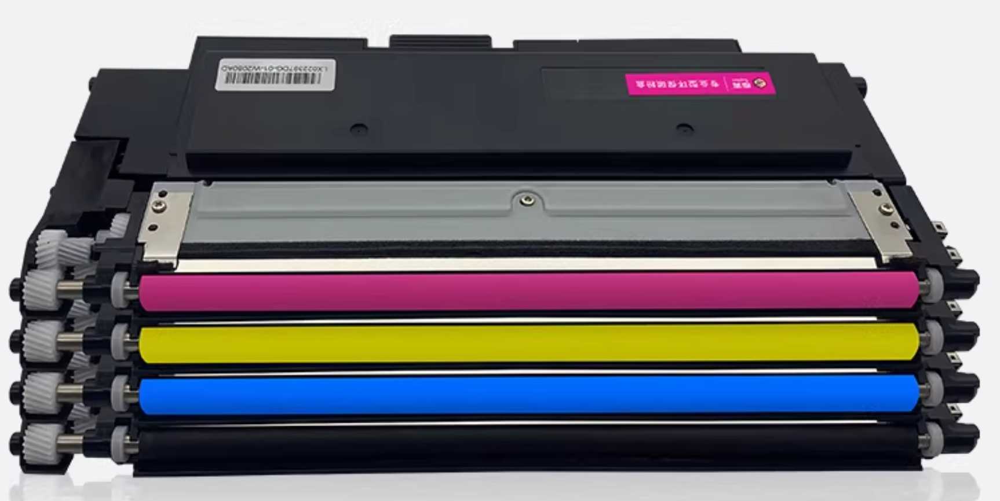

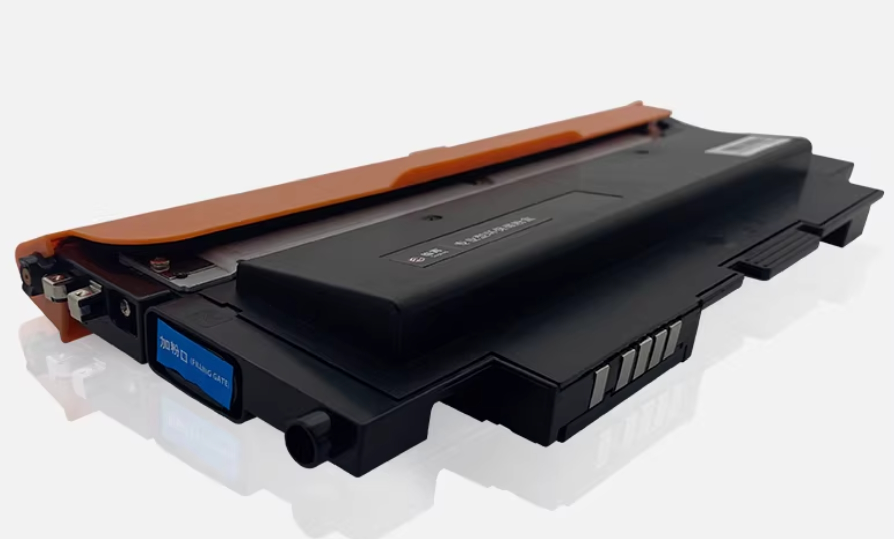

#### 成像鼓

将碳粉实际拼接成图像，并附着到转印带的部件，类似喷墨的喷头。

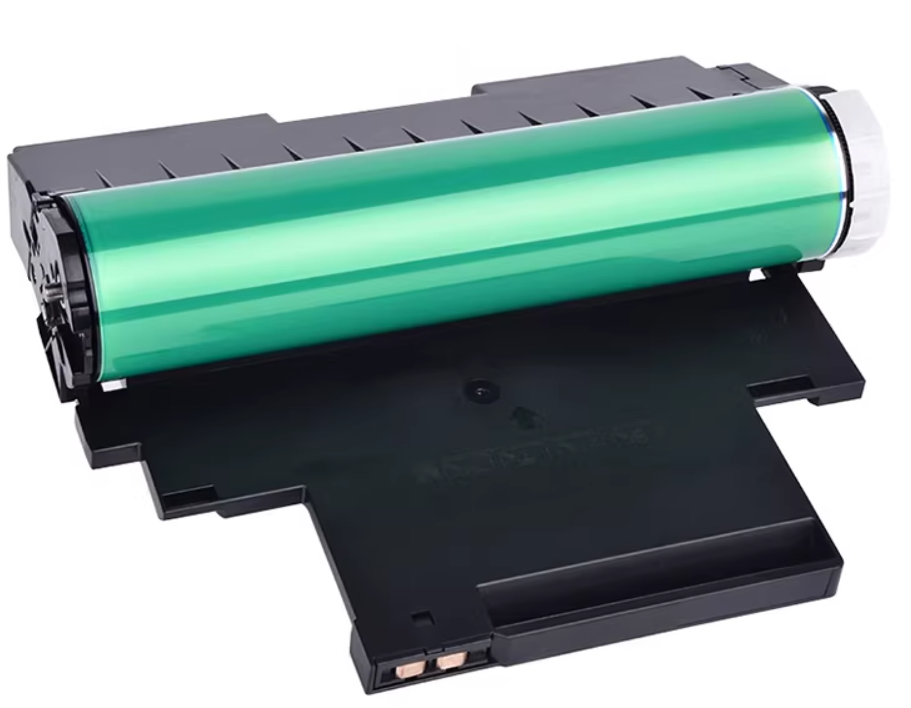

如果是原装的，可能寿命已经不多了，或更换成劣质第三方产的  
只要上面有划痕、印子、污渍，都会直接展现到你的纸上。

#### 转印带

激光和喷墨打印机直接将墨水喷到纸上不同，激光打印机是先将碳粉吸附在转印带上，然后再通过热压的方式将碳粉转印到纸张上。

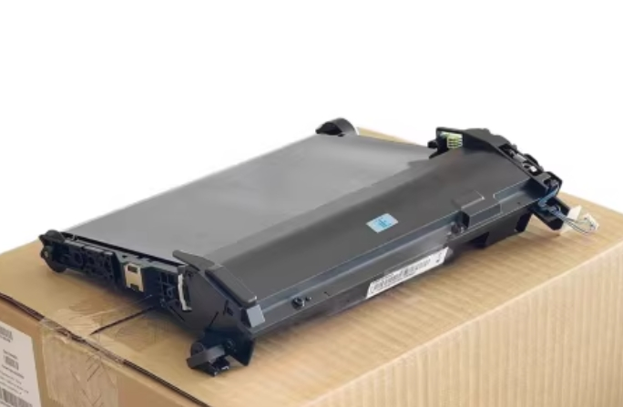

特别容易出问题的部件，一丁点故障就可以让你的打印效果看上去很猎奇。  
最容易出现的就是鬼影(下一张纸有上一张纸的内容)以及废粉无法排到废粉盒里。

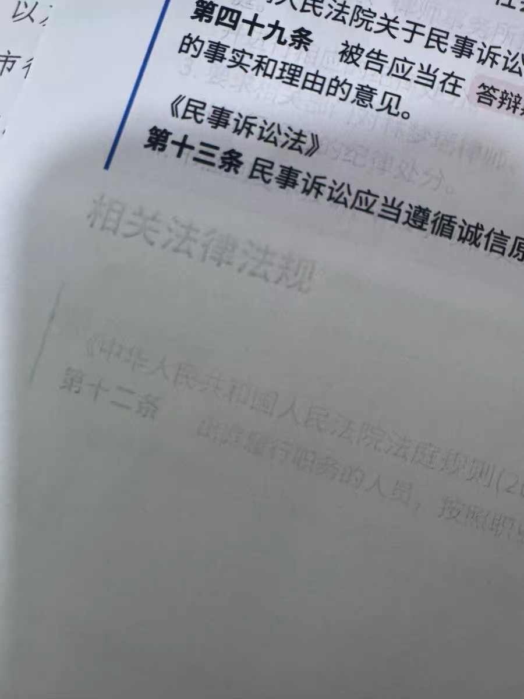

### 以及一些不是特别容易坏，但是坏了也比较要命的部件：

#### 定影组件

基本不容易坏或者很难坏的东西。  
就是一个高温加热棒，通过加热和压力把碳粉压到纸张上的部件。  
但是如果坏了，可能会导致打印出来的东西一摸就掉粉

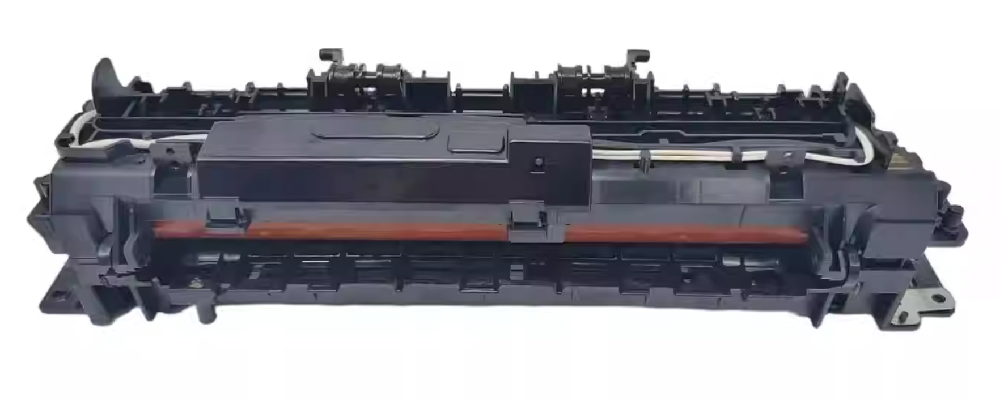

#### 电源板、高压板

基本是最不容易坏的东西。  
但是一旦出现问题，比如高压板老化，就特别容易引起无法排查的故障。

### 以及机身整体

#### 外壳以及金属触点

由于便于维护，上面提到的粉盒、成像鼓、转印带，都是可以非常方便的拆卸。

但便于拆卸也就导致了一个问题：  
这些东西需要电以及传输型号，但并没有电线进行连接，而是通过金属触点进行连接的。  
如果外壳歪了，或者金属触点氧化了/糊上了一些弄不掉的东西，就会导致接触不良，从而出现各种麻烦的问题。

最简单的问题就是读不到你装的粉盒信息，一个粉盒上有6-7个触点，任意一个接触不良就会识别不了然后报错。

#### 损耗部件

举个例子，还是滚纸轮，和上面喷墨打印机一样的问题。

不过激光一般都是纸盒式进纸，就是把纸放在底部的纸盒然后推进机身里，  
这种进纸方式一般不会出现立式进纸器那种一次性带个好几张纸的问题。

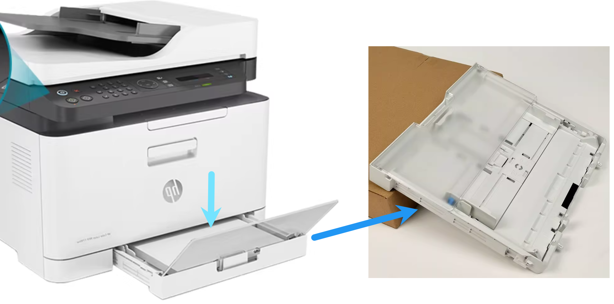

但一旦出现卡纸，就非常要命，你通常需要打开后盖一点一点的把纸取出来。  
最惨的话，你的纸直接整张被卷进定影组件里，那么你就只能几乎拆全机，  
把定影组件拆出来，然后把纸一点一点弄出来。

如果你的机器是有ADF的，也就是全自动扫描器的那种多功能一体机，那就要注意了，  
ADF特别容易出现因为滚纸轮等部件老化而导致的一次性带一堆纸进去的问题。

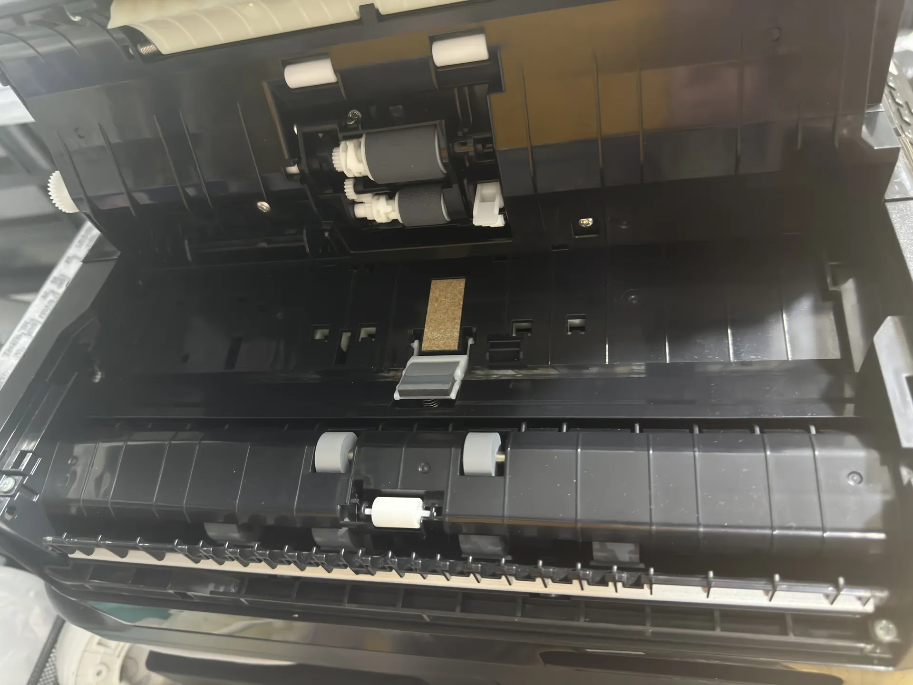

## 关于我的这三台打印机

都算是比较典型的可以用来举例的机器了。

### L8058：六色喷墨

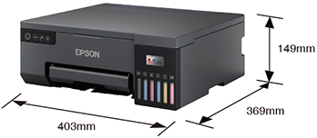

在此先缅怀一下那位已故的朋友 :)

这是一台近几年出的机器，也是比较典型的家庭使用环境下的喷墨打印机。  
六色喷墨的好处是颜色还原度比较高，特别是打印照片时，效果非常棒。

缺点就是没有扫描、只能打印A4，  
且是立式进纸器：不经常维护、进灰、或买的纸不好，就很容易连着好几张纸进去。

喷头我很难评，这台机器虽然很久没有打印，但是一直插着电的。  
按理来说应该会定期进行喷头清洗，但貌似没有。  
这就导致了我所说的“炸墨”问题，不换喷头几乎没法解决了，  
但喷头又是机器的核心，如果真的要换那价格可以直接买新的了。

### L1455：四色喷墨全功能A3+

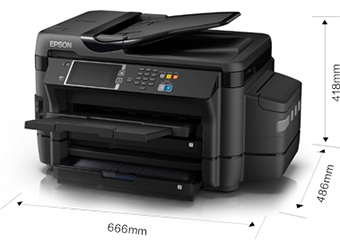

非常老的型号，大概是8-9年前的东西了。  
这个型号是我评估了很久才决定的。

功能非常全：可以打印A3+，可以扫描A3+，可以复印A3+，可以自动双面打印。  
以及最重要的双面ADF，直接把纸放在那，然后就可以自动扫描到Samba/U盘/SD卡了。

缺点就是年代久远，喷头老化，会有一些瑕疵，但几乎可以忽略不计。  
以及因为是全功能机，又是A3+，体积非常大，占地方。

这是我最满意的一台，买来的时候是直接打着木架发过来的，并且计数器只有3000页。

### MFP179fnw：四色激光全功能A4

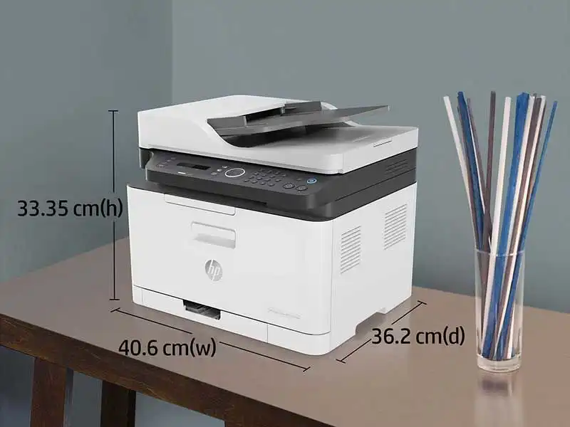

这台也是7-8年前的型号了。因为只是A4的机器所以体积一般，家用能接受（但突出来一节的纸盘是真的难看）。

其实有上面那两台已经够用了，但是因为最近经常往法院跑，法院用的全部是激光，于是闲的没事随便搜了下。  
发现激光竟然也能四色并且还能CMYK混合？并且看上去画面还不错？处于好奇以及折腾的心理，就买了下来。

结果就是我把上面提到的二手激光打印机的坑全部踩了一遍：

- 粉盒是垃圾
- 成像鼓上面的印子很多
- 转印带已经老化到出鬼影、废粉卡住出不来
- 前面的盖子断了个脚（不知道是快递摔坏的还是本来就这样，用502粘了下）
- 卡纸，整张纸被卷进定影组件里面，几乎拆全机才弄出来，弄出来的时候那加热棒还烫手

然后发现激光的才是最难折腾的，比喷墨还麻烦。

我几乎是把这个打印机的全部可以拆卸的东西都换了一遍了，包括粉盒、成像鼓、转印带、定影组件、滚纸轮，甚至电源板和高压板。  
只是为了解决鬼影的问题。现在大概…… 应该是解决了。  
我甚至把一本100多页的技术手册都仔仔细细的读完了。

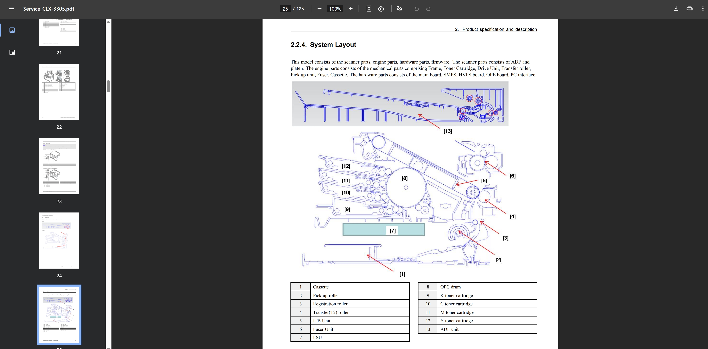

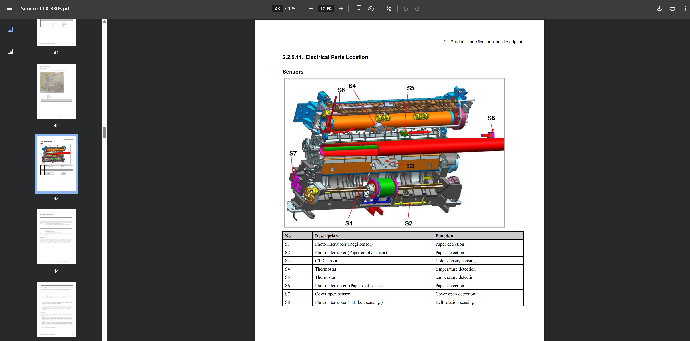

PDF: https://overchip.net/files/service/Service_CLX-3305.pdf  
(别问我为什么是CLX-3305，因为HP收购了三星的打印机业务，这台机器其实就是三星的CLX-3305贴了个惠普标)

所以我特别不推荐买二手激光打印机，真的开盲盒。  
除非你愿意折腾，否则乖乖选择便宜点的全新喷墨。

## 关于纸张的选择

这里真心不推荐买pdd上十块钱出头一包500张的那种还宣传有80g的打印纸。  
基本都是虚假宣传，到手了缺页数、缺克数都是小问题，  
更严重的是纸张质量极差，根本不适用于打印机，非常容易卡纸、掉屑、印出来的效果也不好。  
用这种纸打印你大概率需要把纸拿出来后，将每一页翻一下，然后再甩一甩，才能不那么容易卡纸。

你只需要把预算提升到16~20一包(500张)，并且选择品牌的打印纸，就基本不会遇到任何关于纸的影响体验的问题。

普通纸70g或80g可以按需选择：  
70g比较适合页数非常多，但你又不希望太厚的的场景，不过在喷墨打印机上就很容易穿透。  
80g就比较厚，适合绝大多数场景，喷墨基本不会穿透。

打印照片则需要买光面纸，专门的照片纸，普通打印纸即便是6色喷墨，也没法打印出好效果的。  
以及还有自带背胶的打印纸、100g+的特厚纸等，哪种适合你(你觉得有玩头)就选哪种。

## 总结

如果你不爱折腾，但十分需要一个打印机，那么你可以立即将上面的一堆批话忘掉，然后立刻去买全新的喷墨打印机。

为什么？因为有质保。  
这种机器一般不会出问题，即使出了问题，你的绝大多数问题都有人工指导解决，实在不行还能直接找官方送修。

但是记住，请买机器自身就带连供（可以让你把墨水加到专门的墨盒）的型号，  
千万不要买那种在喷头上打孔，连着管子在机器边上外挂一个尿袋(墨仓)的型号。  
不要问，问就是这种的就纯粹电子垃圾。

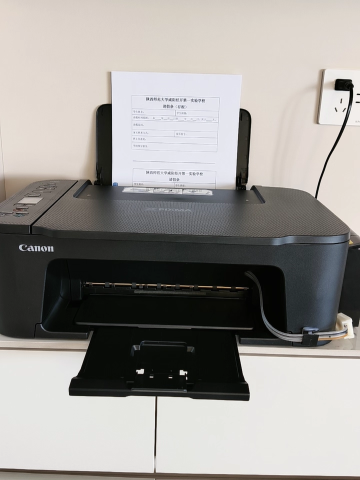
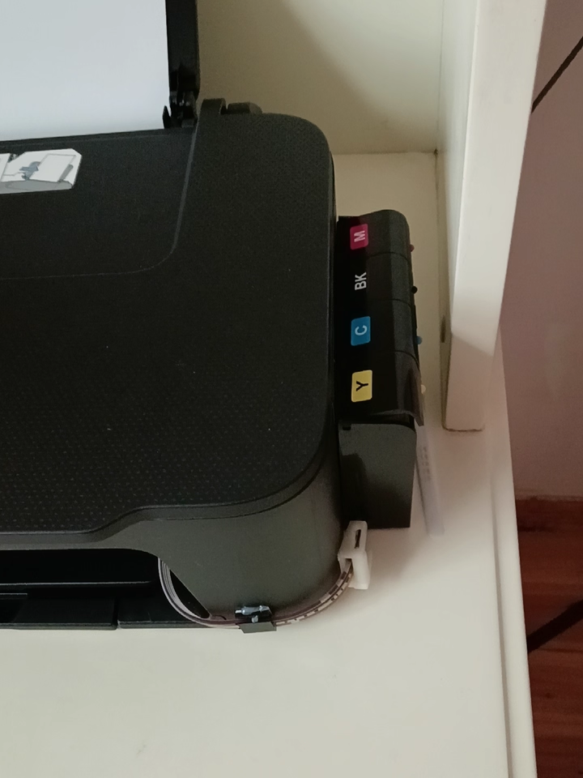

---

如果你真的不嫌麻烦，敢买二手的，那我只能说你是勇士。  
首先是咸鱼上的各种套路，应该不用我赘述了。

请做好折腾的准备，先找这个机器的说明书来看一看，然后最好能找到官方的技术手册/维修手册，仔细读一下。

喷墨的主要就是看喷头，这比较简单就能排查出问题。  
激光的主要就是看消耗品和机身整体状况，但这几乎没法在卖家的宣传上看出来，基本要做好开盲盒的准备。

最后，祝你玩得愉快 :)
